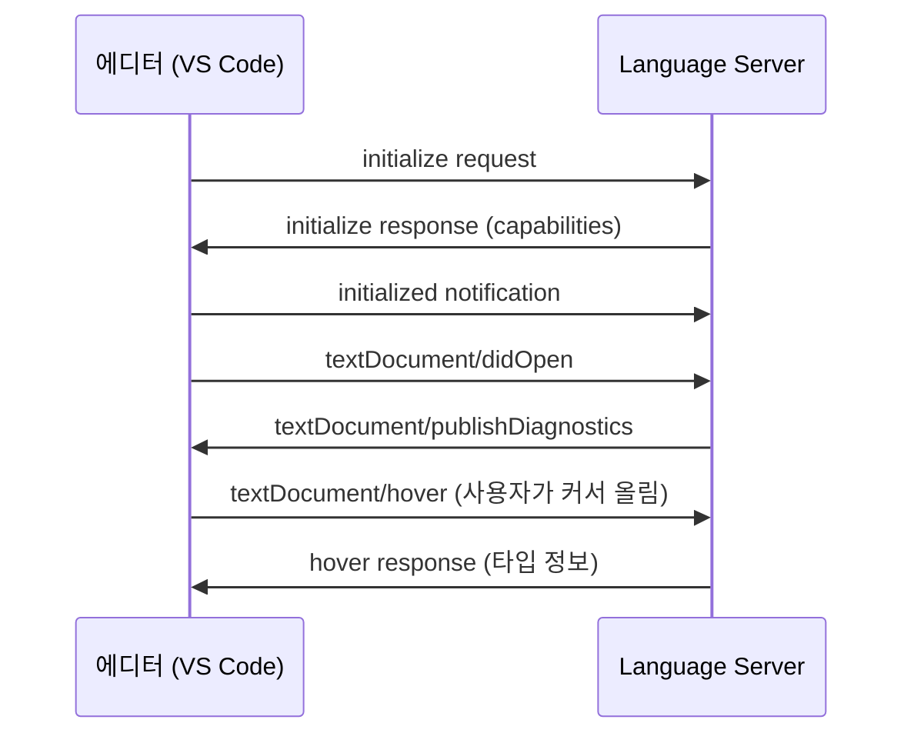

# LSP 개념 소개

이 문서는 Language Server Protocol(LSP)의 핵심 개념을 설명합니다. LSP 서버를 구현하기 전에 반드시 이해해야 할 기초 개념들을 다룹니다.

## 목차

1. [LSP란 무엇인가](#lsp란-무엇인가)
2. [클라이언트-서버 아키텍처](#클라이언트-서버-아키텍처)
3. [JSON-RPC 프로토콜](#json-rpc-프로토콜)
4. [Capability Negotiation](#capability-negotiation-기능-협상)
5. [Document Synchronization](#document-synchronization-문서-동기화)
6. [실시간 진단](#실시간-진단-real-time-diagnostics)

---

## LSP란 무엇인가

**Language Server Protocol(LSP)**은 프로그래밍 언어 지원 기능(자동 완성, 정의 찾기, 오류 진단 등)을 에디터/IDE와 언어 분석 엔진 사이에서 표준화한 프로토콜입니다.

### 문제: 에디터 종속성

LSP 이전에는 각 에디터마다 각 언어에 대한 별도의 플러그인이 필요했습니다.

```
M개 에디터 × N개 언어 = M × N개 플러그인
```

예시:
- VS Code용 Python 플러그인
- Vim용 Python 플러그인
- Emacs용 Python 플러그인
- Sublime용 Python 플러그인
- ... (각 에디터마다 반복)

이 방식은 유지보수가 어렵고 중복 개발이 심했습니다.

### 해결책: LSP 표준화

LSP는 이 문제를 **M + N** 구조로 바꿨습니다.

```
M개 에디터 (LSP 클라이언트) + N개 언어 (LSP 서버) = M + N개 구현
```

각 에디터는 LSP 클라이언트만 구현하면 되고, 각 언어는 LSP 서버만 구현하면 됩니다. 그러면 모든 조합이 자동으로 작동합니다.

### 역사

- **2016년**: Microsoft가 VS Code와 함께 LSP 발표
- **2017-2019년**: Vim, Emacs, Sublime, IntelliJ 등 주요 에디터에서 LSP 클라이언트 구현
- **2025년**: 사실상 업계 표준으로 정착, LSP 3.17 스펙 릴리스

---

## 클라이언트-서버 아키텍처

LSP는 **클라이언트-서버 모델**로 동작합니다.

### 구성 요소

**클라이언트 (Client)**
- 에디터/IDE가 실행하는 부분
- 사용자 인터페이스 담당
- 예: VS Code, Neovim, Emacs, Helix

**서버 (Server)**
- 별도 프로세스로 실행되는 언어 분석 엔진
- 코드 파싱, 타입 체킹, 진단 생성 등 담당
- 예: `pyright` (Python), `rust-analyzer` (Rust), `gopls` (Go)

### 프로세스 간 통신

클라이언트와 서버는 **별도 프로세스**로 실행되며, 다음 방법으로 통신합니다.

```
┌─────────────┐                          ┌─────────────┐
│             │                          │             │
│  VS Code    │  ◄─── JSON-RPC ───►     │   Language  │
│  (Client)   │       over stdio         │   Server    │
│             │                          │             │
└─────────────┘                          └─────────────┘
   Process 1                                Process 2
```

**통신 방식:**
1. **stdin/stdout** (가장 일반적) - 표준 입출력을 통한 파이프 통신
2. **Socket** - TCP 소켓 연결
3. **Named Pipe** - Windows 명명된 파이프

대부분의 LSP 서버는 stdin/stdout을 사용합니다. 에디터가 서버를 자식 프로세스로 실행하고, 표준 입출력을 통해 메시지를 주고받습니다.

### 아키텍처 다이어그램



---

## JSON-RPC 프로토콜

LSP는 **JSON-RPC 2.0** 프로토콜을 기반으로 합니다.

### 메시지 형식

모든 LSP 메시지는 다음 형식을 따릅니다.

```
Content-Length: <바이트 수>\r\n
\r\n
{JSON 본문}
```

**예시:**

```
Content-Length: 123\r\n
\r\n
{"jsonrpc":"2.0","id":1,"method":"initialize","params":{...}}
```

### 메시지 타입

LSP는 3가지 메시지 타입을 사용합니다.

#### 1. Request (요청)

클라이언트 또는 서버가 상대방에게 작업을 요청하고 응답을 기다립니다.

```json
{
  "jsonrpc": "2.0",
  "id": 1,
  "method": "textDocument/hover",
  "params": {
    "textDocument": {"uri": "file:///path/to/file.fun"},
    "position": {"line": 5, "character": 10}
  }
}
```

#### 2. Response (응답)

Request에 대한 응답입니다.

```json
{
  "jsonrpc": "2.0",
  "id": 1,
  "result": {
    "contents": {
      "kind": "markdown",
      "value": "**함수**: `add`\n\n타입: `(Int, Int) -> Int`"
    }
  }
}
```

#### 3. Notification (알림)

응답을 기대하지 않는 단방향 메시지입니다. `id` 필드가 없습니다.

```json
{
  "jsonrpc": "2.0",
  "method": "textDocument/didChange",
  "params": {
    "textDocument": {"uri": "file:///path/to/file.fun", "version": 2},
    "contentChanges": [...]
  }
}
```

### Initialize 핸드셰이크

모든 LSP 세션은 `initialize` 요청으로 시작됩니다.

**클라이언트 → 서버:**

```json
{
  "jsonrpc": "2.0",
  "id": 1,
  "method": "initialize",
  "params": {
    "processId": 1234,
    "rootUri": "file:///path/to/project",
    "capabilities": {
      "textDocument": {
        "hover": {"contentFormat": ["markdown", "plaintext"]}
      }
    }
  }
}
```

**서버 → 클라이언트:**

```json
{
  "jsonrpc": "2.0",
  "id": 1,
  "result": {
    "capabilities": {
      "hoverProvider": true,
      "completionProvider": {"triggerCharacters": ["."]},
      "textDocumentSync": 2
    }
  }
}
```

---

## Capability Negotiation (기능 협상)

LSP의 핵심 설계 원칙 중 하나는 **기능 협상**입니다. 모든 서버가 모든 기능을 구현할 필요는 없습니다.

### 클라이언트 Capabilities

`initialize` 요청에서 클라이언트가 지원하는 기능을 알립니다.

```fsharp
type ClientCapabilities = {
    textDocument: TextDocumentClientCapabilities option
    workspace: WorkspaceClientCapabilities option
}
```

**예시:**
- Markdown 포맷 지원 여부
- 동적 등록(dynamic registration) 지원 여부
- 특정 LSP 메서드 지원 여부

### 서버 Capabilities

`initialize` 응답에서 서버가 제공하는 기능을 선언합니다.

```fsharp
type ServerCapabilities = {
    textDocumentSync: TextDocumentSyncKind option
    hoverProvider: bool option
    completionProvider: CompletionOptions option
    definitionProvider: bool option
    referencesProvider: bool option
    documentSymbolProvider: bool option
    renameProvider: bool option
    codeActionProvider: bool option
}
```

### 주요 Capabilities

| Capability | 설명 | 에디터에서 보이는 기능 |
|------------|------|----------------------|
| `textDocumentSync` | 문서 동기화 방식 (Full/Incremental) | 필수 |
| `hoverProvider` | 커서 아래 정보 제공 | 호버 툴팁 |
| `completionProvider` | 자동 완성 제안 | IntelliSense |
| `definitionProvider` | 정의 위치 찾기 | "Go to Definition" |
| `referencesProvider` | 참조 찾기 | "Find All References" |
| `renameProvider` | 심볼 이름 변경 | "Rename Symbol" |
| `diagnosticProvider` | 오류/경고 진단 | 빨간 밑줄 |

**중요**: 서버가 `hoverProvider: true`를 선언하지 않으면, 클라이언트는 `textDocument/hover` 요청을 보내지 않습니다.

---

## Document Synchronization (문서 동기화)

에디터에서 파일을 열고 편집하면, 서버는 그 변경사항을 알아야 합니다. 이를 **문서 동기화**라고 합니다.

### Lifecycle 이벤트

#### textDocument/didOpen

사용자가 파일을 열면 클라이언트가 보내는 알림입니다.

```json
{
  "method": "textDocument/didOpen",
  "params": {
    "textDocument": {
      "uri": "file:///path/to/file.fun",
      "languageId": "funlang",
      "version": 1,
      "text": "let x = 42\nlet y = x + 10"
    }
  }
}
```

#### textDocument/didChange

사용자가 파일을 편집하면 보내는 알림입니다.

```json
{
  "method": "textDocument/didChange",
  "params": {
    "textDocument": {
      "uri": "file:///path/to/file.fun",
      "version": 2
    },
    "contentChanges": [
      {
        "range": {"start": {"line": 1, "character": 8}, "end": {"line": 1, "character": 10}},
        "text": "20"
      }
    ]
  }
}
```

#### textDocument/didClose

파일을 닫으면 보내는 알림입니다. 서버는 메모리에서 해당 파일 정보를 제거할 수 있습니다.

### Sync 방식

서버는 두 가지 동기화 방식 중 하나를 선택할 수 있습니다.

#### 1. Full Sync (TextDocumentSyncKind.Full = 1)

매번 **전체 문서 내용**을 전송합니다.

**장점**: 구현이 간단
**단점**: 큰 파일에서 네트워크 비용 증가

#### 2. Incremental Sync (TextDocumentSyncKind.Incremental = 2)

**변경된 부분만** (range + text) 전송합니다.

**장점**: 효율적, 네트워크 비용 감소
**단점**: 구현 복잡도 증가 (range 관리)

**권장**: 대부분의 프로덕션 서버는 Incremental Sync를 사용합니다.

---

## 실시간 진단 (Real-time Diagnostics)

LSP의 가장 강력한 기능 중 하나는 **실시간 오류/경고 표시**입니다.

### textDocument/publishDiagnostics

서버가 클라이언트에게 진단 정보를 보내는 알림입니다. (Request가 아닌 **Notification**)

```json
{
  "method": "textDocument/publishDiagnostics",
  "params": {
    "uri": "file:///path/to/file.fun",
    "diagnostics": [
      {
        "range": {
          "start": {"line": 5, "character": 10},
          "end": {"line": 5, "character": 15}
        },
        "severity": 1,
        "message": "Undefined variable 'hello'",
        "source": "FunLang"
      }
    ]
  }
}
```

### Diagnostic 구조

```fsharp
type Diagnostic = {
    range: Range              // 오류 위치
    severity: DiagnosticSeverity option  // 1=Error, 2=Warning, 3=Info, 4=Hint
    code: string option       // 오류 코드 (예: "E0001")
    source: string option     // "FunLang", "TypeChecker" 등
    message: string           // 오류 메시지
    relatedInformation: DiagnosticRelatedInformation[] option
}
```

### Severity 레벨

| Severity | 값 | 의미 | 에디터 표시 |
|----------|---|------|------------|
| Error | 1 | 컴파일 불가능한 오류 | 빨간 밑줄 |
| Warning | 2 | 잠재적 문제 | 노란 밑줄 |
| Information | 3 | 정보성 메시지 | 파란 밑줄 |
| Hint | 4 | 제안 | 회색 점선 |

### 진단 흐름

```
사용자가 코드 편집
    ↓
textDocument/didChange 알림
    ↓
서버가 코드 분석 (파싱 → 타입 체킹)
    ↓
textDocument/publishDiagnostics 알림
    ↓
에디터가 빨간 밑줄 표시
```

**중요**: `publishDiagnostics`는 서버가 능동적으로 보내는 알림입니다. 클라이언트가 요청하지 않아도 서버가 변경 감지 시 자동으로 전송합니다.

---

## 다음 단계

이제 LSP의 핵심 개념을 이해했습니다.

- **클라이언트-서버 아키텍처**: 별도 프로세스로 동작
- **JSON-RPC**: Content-Length 헤더 + JSON 본문
- **Capability Negotiation**: 서버가 지원하는 기능 선언
- **Document Sync**: didOpen, didChange, didClose
- **Diagnostics**: 실시간 오류 표시

다음 문서에서는 F#으로 LSP 서버를 구현하기 위한 라이브러리 선택을 다룹니다.

**→ [02-library-choice.md](./02-library-choice.md)**

---

## 참고 자료

- [LSP 공식 스펙](https://microsoft.github.io/language-server-protocol/specifications/lsp/3.17/specification/)
- [JSON-RPC 2.0 스펙](https://www.jsonrpc.org/specification)
- [LSP 공식 웹사이트](https://microsoft.github.io/language-server-protocol/)
