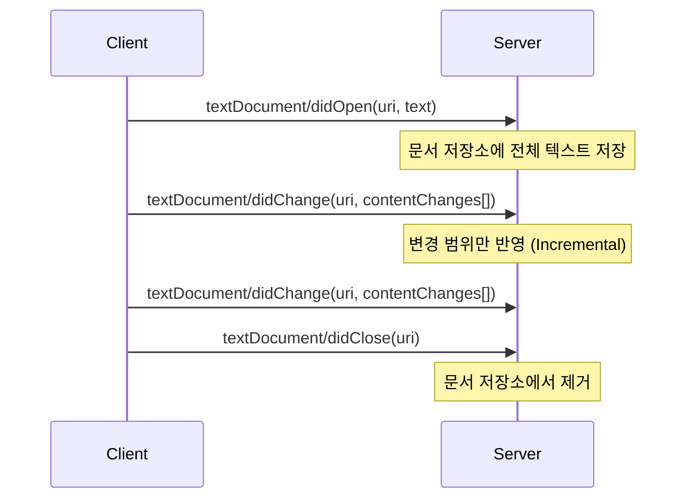

# 문서 동기화 구현

이 문서는 LSP 서버에서 **Document Sync**(문서 동기화)를 구현하는 방법을 설명한다. 문서 동기화는 에디터에서 파일을 열고, 수정하고, 닫을 때마다 LSP 서버가 최신 텍스트를 유지하도록 한다.

## 목차

1. [문서 동기화란](#문서-동기화란)
2. [동기화 모드](#동기화-모드)
3. [ConcurrentDictionary로 문서 저장](#concurrentdictionary로-문서-저장)
4. [didOpen 핸들러](#didopen-핸들러)
5. [didChange 핸들러](#didchange-핸들러)
6. [didClose 핸들러](#didclose-핸들러)
7. [테스트 작성](#테스트-작성)

---

## 문서 동기화란

**Document Sync**는 LSP의 핵심 기능 중 하나로, 에디터와 Language Server 간에 문서 텍스트를 동기화하는 프로세스이다.

### 왜 필요한가?

LSP 서버는 별도 프로세스로 실행되므로, 에디터가 파일을 읽거나 수정해도 서버는 그 내용을 자동으로 알 수 없다. 따라서 에디터는 다음 이벤트를 서버로 전송해야 한다.

| 이벤트 | LSP 메서드 | 설명 |
|--------|-----------|------|
| 파일 열기 | `textDocument/didOpen` | 에디터에서 파일을 처음 열 때 전체 텍스트 전송 |
| 파일 수정 | `textDocument/didChange` | 파일이 수정될 때마다 변경 사항 전송 |
| 파일 닫기 | `textDocument/didClose` | 에디터에서 파일을 닫을 때 알림 |



### 문서 동기화가 필요한 LSP 기능

문서 동기화는 거의 모든 LSP 기능의 전제조건이다.

- **Diagnostics**: 문서 텍스트를 파싱/타입체킹하여 에러 검출
- **Hover**: 커서 위치의 텍스트를 분석하여 타입 정보 표시
- **Completion**: 현재 텍스트 맥락에서 자동완성 제안
- **Go to Definition**: 심볼 위치를 찾기 위해 전체 텍스트 분석

---

## 동기화 모드

LSP는 두 가지 동기화 모드를 지원한다.

### 1. Full Sync (전체 동기화)

매번 변경 시 **전체 텍스트**를 전송한다.

**장점:**
- 구현이 간단 (문자열 교체만 하면 됨)
- 동기화 오류 가능성 낮음

**단점:**
- 대용량 파일에서 비효율적 (1줄 변경해도 100KB 파일 전체 전송)

```fsharp
// Full Sync 예시
let handleDidChangeFullSync (p: DidChangeTextDocumentParams) : unit =
    let uri = p.TextDocument.Uri
    let newText = p.ContentChanges.[0].Text  // 전체 텍스트
    documents.[uri] <- newText
```

### 2. Incremental Sync (증분 동기화)

변경된 **부분(Range)만** 전송한다.

**장점:**
- 대용량 파일에서 효율적 (변경된 10자만 전송)
- 네트워크 트래픽 감소

**단점:**
- 구현이 복잡 (Range 기반 문자열 교체 로직 필요)

```fsharp
// Incremental Sync 예시
// "let x = 1"을 "let y = 1"로 변경하려면:
// Range: line 0, character 4-5 (x의 위치)
// Text: "y"
```

FunLang LSP는 **Incremental Sync**를 사용한다. (성능과 실용성의 균형)

### Server Capabilities 선언

서버가 어떤 동기화 모드를 지원하는지 `initialize` 응답에서 선언한다.

```fsharp
// Server.fs
let serverCapabilities : ServerCapabilities =
    { ServerCapabilities.Default with
        TextDocumentSync =
            Some (U2.C1 {
                TextDocumentSyncOptions.Default with
                    OpenClose = Some true  // didOpen/didClose 지원
                    Change = Some TextDocumentSyncKind.Incremental  // 증분 동기화
            })
    }
```

---

## ConcurrentDictionary로 문서 저장

LSP 서버는 여러 문서를 동시에 추적해야 하므로, 스레드 안전한 저장소가 필요하다.

### 왜 ConcurrentDictionary인가?

LSP 서버는 **다중 스레드 환경**에서 동작한다:
- 에디터가 `didOpen`, `didChange`, `didClose` 알림을 비동기로 보냄
- 서버는 여러 요청을 병렬로 처리할 수 있음
- 단순 `Dictionary`는 스레드 안전하지 않아 Race Condition 발생 가능

`ConcurrentDictionary`는 .NET의 스레드 안전한 해시맵으로, 락 없이 동시 읽기/쓰기가 가능하다.

### 구현

```fsharp
// DocumentSync.fs
module LangLSP.Server.DocumentSync

open System.Collections.Concurrent
open Ionide.LanguageServerProtocol.Types

/// Thread-safe document storage (URI -> text content)
let private documents = ConcurrentDictionary<string, string>()

/// Get document text by URI (for diagnostics, hover, etc.)
let getDocument (uri: string) : string option =
    match documents.TryGetValue(uri) with
    | true, text -> Some text
    | false, _ -> None
```

**설계 포인트:**
- `private documents`: 모듈 내부에서만 접근 가능 (캡슐화)
- `URI -> string`: 파일 경로(URI)를 키로, 텍스트를 값으로 저장
- `getDocument`: 외부 모듈이 문서 내용을 안전하게 읽을 수 있도록 제공

---

## didOpen 핸들러

파일이 에디터에서 열릴 때 호출되는 핸들러이다.

### 프로토콜 구조

```typescript
// LSP 프로토콜 (TypeScript 정의)
interface DidOpenTextDocumentParams {
    textDocument: {
        uri: string          // 파일 URI (예: "file:///path/to/test.fun")
        languageId: string   // 언어 ID (예: "funlang")
        version: number      // 문서 버전 (1부터 시작)
        text: string         // 전체 파일 텍스트
    }
}
```

### 구현

```fsharp
/// Handle textDocument/didOpen
let handleDidOpen (p: DidOpenTextDocumentParams) : unit =
    let uri = p.TextDocument.Uri
    let text = p.TextDocument.Text
    documents.[uri] <- text
```

**동작 흐름:**
1. 파라미터에서 `Uri`와 `Text` 추출
2. `ConcurrentDictionary`에 저장
3. 이제 `getDocument(uri)`로 텍스트 조회 가능

**예시:**
```fsharp
// 에디터에서 "test.fun" 파일을 열면:
// Uri = "file:///home/user/test.fun"
// Text = "let x = 1 + 2"

handleDidOpen { TextDocument = { Uri = "file:///home/user/test.fun"; Text = "let x = 1 + 2"; ... } }

// 이후 getDocument로 조회 가능
getDocument "file:///home/user/test.fun"
// -> Some "let x = 1 + 2"
```

---

## didChange 핸들러

파일이 수정될 때 호출되는 핸들러로, **증분 변경**을 처리한다.

### 프로토콜 구조

```typescript
interface DidChangeTextDocumentParams {
    textDocument: {
        uri: string
        version: number
    }
    contentChanges: TextDocumentContentChangeEvent[]
}

type TextDocumentContentChangeEvent =
    | { range: Range; text: string }  // 증분 변경 (C1)
    | { text: string }                // 전체 변경 (C2)
```

Ionide.LanguageServerProtocol은 Union 타입을 `U2<C1, C2>`로 표현한다.

### Range 기반 텍스트 교체

증분 변경은 **Range**로 교체할 영역을 지정한다.

```fsharp
// LSP Range 구조
type Range = {
    Start: Position  // { Line: uint32; Character: uint32 }
    End: Position
}
```

**예시:** `"let x = 1"`을 `"let y = 1"`로 변경

```
텍스트:  l  e  t     x     =     1
인덱스:  0  1  2  3  4  5  6  7  8

Range: { Start: { Line: 0, Character: 4 }, End: { Line: 0, Character: 5 } }
Text: "y"

결과: "let " + "y" + " = 1" = "let y = 1"
```

### 구현

```fsharp
/// Convert line/character to string offset
/// Note: LSP positions are 0-based
let private getOffset (lines: string[]) (line: int) (character: int) : int =
    let mutable offset = 0
    for i in 0 .. line - 1 do
        if i < lines.Length then
            offset <- offset + lines.[i].Length + 1  // +1 for newline
    offset + min character (if line < lines.Length then lines.[line].Length else 0)

/// Apply incremental text changes to document
/// LSP changes are applied in order; each change has a Range to replace
let private applyContentChanges (text: string) (changes: TextDocumentContentChangeEvent array) : string =
    changes
    |> Array.fold (fun currentText change ->
        match change with
        | U2.C1 incrementalChange ->
            // Incremental change: replace text at range
            let range = incrementalChange.Range
            let lines = currentText.Split([|'\n'|], System.StringSplitOptions.None)
            let startOffset = getOffset lines (int range.Start.Line) (int range.Start.Character)
            let endOffset = getOffset lines (int range.End.Line) (int range.End.Character)
            currentText.Substring(0, startOffset) + incrementalChange.Text + currentText.Substring(endOffset)
        | U2.C2 fullChange ->
            // Full sync fallback
            fullChange.Text
    ) text

/// Handle textDocument/didChange
let handleDidChange (p: DidChangeTextDocumentParams) : unit =
    let uri = p.TextDocument.Uri
    match documents.TryGetValue(uri) with
    | true, currentText ->
        let newText = applyContentChanges currentText p.ContentChanges
        documents.[uri] <- newText
    | false, _ ->
        // Document not tracked - this shouldn't happen, but handle gracefully
        ()
```

**핵심 로직:**
1. **getOffset**: LSP Position (line, character)을 문자열 오프셋으로 변환
   - 줄바꿈(`\n`)을 고려하여 절대 위치 계산
2. **applyContentChanges**: 여러 변경 사항을 순차적으로 적용
   - `U2.C1`: 증분 변경 → Range로 부분 문자열 교체
   - `U2.C2`: 전체 변경 → 전체 텍스트 교체 (Fallback)
3. **handleDidChange**: 문서를 조회하여 변경 적용 후 다시 저장

**멀티라인 예시:**

```
원본:
"let x = 1\nlet y = 2"

Range: { Start: { Line: 1, Character: 4 }, End: { Line: 1, Character: 5 } }
Text: "z"

Step 1: lines = ["let x = 1", "let y = 2"]
Step 2: startOffset = (len("let x = 1") + 1) + 4 = 10 + 4 = 14
Step 3: endOffset = 15
Step 4: "let x = 1\nlet " + "z" + " = 2" = "let x = 1\nlet z = 2"
```

---

## didClose 핸들러

파일이 에디터에서 닫힐 때 호출되는 핸들러이다.

### 구현

```fsharp
/// Handle textDocument/didClose
let handleDidClose (p: DidCloseTextDocumentParams) : unit =
    let uri = p.TextDocument.Uri
    documents.TryRemove(uri) |> ignore
```

**동작:**
- `ConcurrentDictionary`에서 문서 제거
- `TryRemove`는 `(bool * string)` 튜플을 반환하지만, 성공 여부는 무시 (`|> ignore`)

**왜 제거해야 하나?**
- 메모리 절약: 닫힌 파일은 더 이상 추적할 필요 없음
- 에디터가 파일을 다시 열면 `didOpen`으로 새로 추가됨

---

## 테스트 작성

Expecto를 사용하여 Document Sync 기능을 테스트한다.

### 테스트 헬퍼 함수

```fsharp
// DocumentSyncTests.fs
module LangLSP.Tests.DocumentSyncTests

open Expecto
open LangLSP.Server.DocumentSync
open Ionide.LanguageServerProtocol.Types

let makeDidOpenParams uri text : DidOpenTextDocumentParams =
    {
        TextDocument = {
            Uri = uri
            LanguageId = "funlang"
            Version = 1
            Text = text
        }
    }

let makeDidCloseParams uri : DidCloseTextDocumentParams =
    { TextDocument = { Uri = uri } }

let makeDidChangeParams uri version changes : DidChangeTextDocumentParams =
    {
        TextDocument = { Uri = uri; Version = version }
        ContentChanges = changes
    }
```

### 테스트 케이스

```fsharp
[<Tests>]
let documentSyncTests =
    testSequenced <| testList "DocumentSync" [

        testCase "didOpen stores document text" <| fun _ ->
            clearAll()
            let uri = "file:///test.fun"
            let text = "let x = 1"
            handleDidOpen (makeDidOpenParams uri text)
            Expect.equal (getDocument uri) (Some text) "Document should be stored"

        testCase "didClose removes document" <| fun _ ->
            clearAll()
            let uri = "file:///test.fun"
            handleDidOpen (makeDidOpenParams uri "let x = 1")
            handleDidClose (makeDidCloseParams uri)
            Expect.equal (getDocument uri) None "Document should be removed"

        testCase "didChange with full sync replaces text" <| fun _ ->
            clearAll()
            let uri = "file:///test.fun"
            handleDidOpen (makeDidOpenParams uri "let x = 1")
            let change = U2.C2 { Text = "let y = 2" }
            handleDidChange (makeDidChangeParams uri 2 [| change |])
            Expect.equal (getDocument uri) (Some "let y = 2") "Text should be replaced"

        testCase "didChange with incremental sync modifies range" <| fun _ ->
            clearAll()
            let uri = "file:///test.fun"
            handleDidOpen (makeDidOpenParams uri "let x = 1")
            // Change 'x' to 'y' (position 4, length 1)
            let range = { Start = { Line = 0u; Character = 4u }; End = { Line = 0u; Character = 5u } }
            let change = U2.C1 { Range = range; RangeLength = None; Text = "y" }
            handleDidChange (makeDidChangeParams uri 2 [| change |])
            Expect.equal (getDocument uri) (Some "let y = 1") "Variable name should be changed"

        testCase "getDocument returns None for unknown URI" <| fun _ ->
            clearAll()
            Expect.equal (getDocument "file:///unknown.fun") None "Unknown document should return None"
    ]
```

**중요 포인트:**
- `testSequenced`: `ConcurrentDictionary`는 테스트 간 공유되므로 순차 실행 필요
- `clearAll()`: 각 테스트 시작 전 상태 초기화
- 증분 변경 테스트: Range를 명시하여 정확한 교체 검증

### 테스트 실행

```bash
dotnet run --project src/LangLSP.Tests

# 출력:
# [DocumentSync] didOpen stores document text - Passed
# [DocumentSync] didClose removes document - Passed
# [DocumentSync] didChange with full sync replaces text - Passed
# [DocumentSync] didChange with incremental sync modifies range - Passed
# [DocumentSync] getDocument returns None for unknown URI - Passed
```

---

## 다음 단계

문서 동기화가 완료되었으므로, 이제 **Diagnostics**(진단)를 구현할 수 있다.

**다음 튜토리얼:** [05-diagnostics.md](./05-diagnostics.md)

Diagnostics 구현에서는 다음을 다룬다:
1. FunLang의 Diagnostic 시스템 활용
2. Span을 LSP Range로 변환 (1-based → 0-based)
3. 문법 오류 및 타입 오류 처리
4. `publishDiagnostics`로 에디터에 에러 전송
5. FsCheck를 활용한 Property-based Testing

---

## 참고 자료

- [LSP Specification - Text Synchronization](https://microsoft.github.io/language-server-protocol/specifications/lsp/3.17/specification/#textDocument_synchronization)
- [ConcurrentDictionary 문서](https://docs.microsoft.com/dotnet/api/system.collections.concurrent.concurrentdictionary-2)
- [Ionide.LanguageServerProtocol GitHub](https://github.com/ionide/LanguageServerProtocol)

---

**→ 다음: [05-diagnostics.md](./05-diagnostics.md)** - 진단 구현
