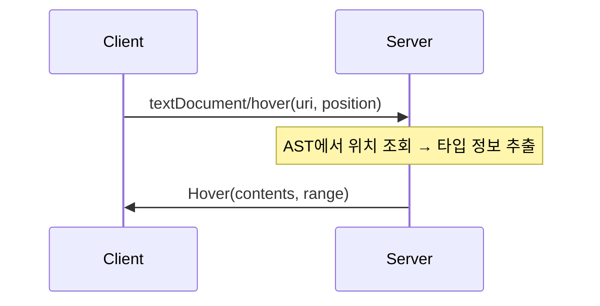

# Hover 구현하기

마우스 커서를 코드 위에 올리면 타입 정보나 설명이 팝업으로 표시된다. 이 기능은 IDE의 핵심 기능 중 하나로, 코드를 이해하는 데 큰 도움이 된다.

이 튜토리얼에서는 FunLang LSP에 Hover 기능을 구현하는 방법을 배운다.

## 목차

1. [textDocument/hover 프로토콜](#textdocumenthover-프로토콜)
2. [구현 전략](#구현-전략)
3. [위치 기반 AST 조회](#위치-기반-ast-조회)
4. [키워드 Hover](#키워드-hover)
5. [타입 Hover](#타입-hover)
6. [서버 통합](#서버-통합)
7. [테스트 작성](#테스트-작성)
8. [흔한 실수와 해결책](#흔한-실수와-해결책)

---

## textDocument/hover 프로토콜

### 요청 구조

클라이언트(에디터)가 서버에 hover 정보를 요청할 때 사용하는 구조이다.

```typescript
interface HoverParams {
    textDocument: TextDocumentIdentifier  // 문서 URI
    position: Position                     // 커서 위치 (0-based)
}

interface Position {
    line: number       // 0-based 줄 번호
    character: number  // 0-based 문자 위치
}
```

### 응답 구조

서버가 반환하는 hover 정보이다.

```typescript
interface Hover {
    contents: MarkupContent     // 표시할 내용
    range?: Range               // 하이라이트할 범위 (선택)
}

interface MarkupContent {
    kind: "plaintext" | "markdown"  // 콘텐츠 종류
    value: string                   // 실제 내용
}
```

### VS Code에서의 표시

```
test.fun
────────
let double = fun x -> x * 2 in double 5
                               ~~~~~~
                        int -> int
```

커서를 `double`에 올리면:
- **하이라이트**: `range`로 지정된 영역에 밑줄 표시
- **팝업**: `contents`의 내용이 툴팁으로 표시
- **Markdown 지원**: 코드 블록, 볼드, 이탤릭 등 포맷팅 가능



---

## 구현 전략

Hover 기능은 두 가지를 제공한다:

1. **키워드 Hover**: `let`, `if`, `fun` 등 키워드에 한국어 설명
2. **타입 Hover**: 변수, 함수, 표현식에 추론된 타입 표시

### 처리 흐름

```
HoverParams 수신
    ↓
문서 텍스트 조회
    ↓
커서 위치의 단어 확인
    ↓ (키워드인 경우)
키워드 설명 반환 ←─┐
    ↓ (그 외)      │
AST 파싱          │
    ↓              │
위치로 노드 찾기    │
    ↓              │
노드 타입 추론      │
    ↓              │
타입 정보 반환     │
```

### 키워드 우선 확인

**중요:** 키워드는 AST에 포함되지 않는다. `let x = 1 in x`를 파싱하면:

- AST: `Let("x", Number(1), Var("x"))`
- `let`, `in` 키워드는 AST 노드가 아니다!

따라서 AST 조회 전에 키워드 체크를 먼저 해야 한다.

---

## 위치 기반 AST 조회

커서 위치에 해당하는 AST 노드를 찾는 모듈이다.

### AstLookup 모듈

```fsharp
// AstLookup.fs
module LangLSP.Server.AstLookup

open Ast
open Ionide.LanguageServerProtocol.Types

/// LSP Position(0-based)이 FunLang Span 내에 있는지 확인
let positionInSpan (lspPos: Position) (span: Span) : bool =
    // LSP와 FunLang 모두 0-based 사용 (LexBuffer.FromString 기본값)
    let line = int lspPos.Line
    let col = int lspPos.Character

    // 범위 확인
    if line < span.StartLine || line > span.EndLine then
        false
    elif line = span.StartLine && line = span.EndLine then
        // 단일 라인 span
        col >= span.StartColumn && col <= span.EndColumn
    elif line = span.StartLine then
        // 시작 라인에 있음
        col >= span.StartColumn
    elif line = span.EndLine then
        // 끝 라인에 있음
        col <= span.EndColumn
    else
        // 중간 라인에 있음
        true
```

### 좌표계 이해하기

**FunLang의 특수 상황:**

FsLexYacc 문서에는 Position이 1-based라고 되어 있지만, `LexBuffer.FromString`으로 생성하면 실제로는 **0-based**이다!

| 항목 | LSP | FunLang (LexBuffer.FromString) |
|------|-----|--------------------------------|
| 첫 번째 줄 | 0 | 0 |
| 첫 번째 열 | 0 | 0 |

따라서 FunLang LSP에서는 **좌표 변환이 필요 없다**.

```fsharp
// Protocol.fs - 변환 없이 직접 사용
let spanToLspRange (span: Span) : Range =
    {
        Start = { Line = uint32 span.StartLine; Character = uint32 span.StartColumn }
        End = { Line = uint32 span.EndLine; Character = uint32 span.EndColumn }
    }
```

### 가장 안쪽 노드 찾기

AST는 중첩 구조이다. 커서 위치에 여러 노드가 겹칠 수 있다.

```
let f = fun x -> x + 1 in f 5
              ~~~~~~~ (x + 1) - Add 노드
                    ~ (1) - Number 노드
```

**innermost(가장 안쪽) 노드**를 반환해야 한다.

```fsharp
/// 주어진 LSP 위치를 포함하는 가장 안쪽 AST 노드 찾기
let rec findNodeAtPosition (lspPos: Position) (expr: Expr) : Expr option =
    let span = spanOf expr

    if not (positionInSpan lspPos span) then
        None
    else
        // 현재 노드 안에 있음 - 자식 노드에서 더 구체적인 매칭 찾기
        let childMatch =
            match expr with
            // 이항 연산자
            | Add(left, right, _)
            | Subtract(left, right, _)
            | App(left, right, _) ->
                match findNodeAtPosition lspPos left with
                | Some node -> Some node
                | None -> findNodeAtPosition lspPos right

            // Let 바인딩
            | Let(_, bindExpr, bodyExpr, _) ->
                match findNodeAtPosition lspPos bindExpr with
                | Some node -> Some node
                | None -> findNodeAtPosition lspPos bodyExpr

            // 람다
            | Lambda(_, body, _) ->
                findNodeAtPosition lspPos body

            // 리프 노드 - 자식 없음
            | Number _ | Bool _ | Var _ -> None

            // ... 다른 노드 타입들

        // 자식 매칭이 있으면 반환, 없으면 현재 노드 반환
        match childMatch with
        | Some node -> Some node
        | None -> Some expr
```

**핵심 원리:**
1. 현재 노드가 위치를 포함하는지 확인
2. 포함하면 자식 노드들을 재귀적으로 확인
3. 자식 중 매칭이 있으면 그것을 반환
4. 없으면 현재 노드가 가장 구체적인 매칭

---

## 키워드 Hover

### 키워드 설명 맵

FunLang의 키워드에 대한 한국어 설명이다.

```fsharp
// Hover.fs
module LangLSP.Server.Hover

/// FunLang 키워드에 대한 한국어 설명
let keywordExplanations = Map.ofList [
    ("let", "변수 또는 함수를 정의합니다.\n예: `let x = 5`")
    ("in", "let 바인딩의 범위를 지정합니다.\n예: `let x = 1 in x + 2`")
    ("if", "조건 분기를 수행합니다.\n예: `if x > 0 then 1 else -1`")
    ("then", "if의 참 분기를 시작합니다.")
    ("else", "if의 거짓 분기를 시작합니다.")
    ("match", "패턴 매칭을 시작합니다.\n예: `match xs with | [] -> 0 | h::t -> h`")
    ("with", "match의 패턴 절을 시작합니다.")
    ("fun", "익명 함수를 정의합니다.\n예: `fun x -> x + 1`")
    ("rec", "재귀 함수를 정의합니다.\n예: `let rec sum n = if n = 0 then 0 else n + sum (n-1)`")
    ("true", "불리언 참 값입니다.")
    ("false", "불리언 거짓 값입니다.")
]
```

### 커서 위치의 단어 추출

```fsharp
/// 소스 텍스트에서 위치의 단어 추출
let getWordAtPosition (text: string) (pos: Position) : string option =
    let lines = text.Split('\n')
    let lineIdx = int pos.Line
    if lineIdx >= lines.Length then None
    else
        let line = lines.[lineIdx]
        let col = int pos.Character
        if col >= line.Length then None
        else
            // 단어 경계 찾기 (알파벳, 숫자, 언더스코어)
            let isWordChar c = System.Char.IsLetterOrDigit(c) || c = '_'
            let mutable startCol = col
            while startCol > 0 && isWordChar line.[startCol - 1] do
                startCol <- startCol - 1
            let mutable endCol = col
            while endCol < line.Length && isWordChar line.[endCol] do
                endCol <- endCol + 1
            if startCol = endCol then None
            else Some (line.Substring(startCol, endCol - startCol))
```

### 키워드 Hover 생성

```fsharp
/// 키워드에 대한 Hover 생성
let createKeywordHover (keyword: string) (pos: Position) : Hover option =
    keywordExplanations
    |> Map.tryFind keyword
    |> Option.map (fun explanation ->
        {
            Contents = U3.C1 {
                Kind = MarkupKind.Markdown
                Value = sprintf "**%s** (키워드)\n\n%s" keyword explanation
            }
            Range = None  // 키워드 전체 범위 계산은 생략
        })
```

**Ionide Union 타입:**
- `Hover.Contents`는 `U3<MarkupContent, MarkedString, MarkedString[]>` 타입
- `U3.C1`은 첫 번째 케이스인 `MarkupContent`를 의미
- Markdown으로 포맷팅하면 에디터에서 예쁘게 표시된다

---

## 타입 Hover

### 타입 정보 표시

```fsharp
/// 타입 정보를 담은 Hover 생성
let createTypeHover (ty: Type.Type) (span: Span) : Hover =
    let typeStr = Type.formatTypeNormalized ty
    {
        Contents = U3.C1 {
            Kind = MarkupKind.Markdown
            Value = sprintf "```funlang\n%s\n```" typeStr
        }
        Range = Some (Protocol.spanToLspRange span)
    }
```

**formatTypeNormalized:**
- FunLang의 타입을 읽기 좋은 문자열로 변환한다
- 타입 변수 정규화: `TVar(1000)` → `'a`, `TVar(1001)` → `'b`
- 예: `TFunc(TInt, TFunc(TInt, TInt))` → `int -> int -> int`

### 노드 타입 추론

```fsharp
/// 노드의 타입 추론 (단순 케이스)
let getNodeType (node: Expr) : Type.Type option =
    match node with
    | Number(_, _) -> Some TInt
    | Bool(_, _) -> Some TBool
    | String(_, _) -> Some TString
    | EmptyList _ -> None  // 요소 타입을 알 수 없음
    | _ ->
        // 그 외 노드는 타입 체커 사용
        match TypeCheck.typecheck node with
        | Ok ty -> Some ty
        | Error _ -> None
```

### 변수 타입 조회의 어려움

**문제:** `Var("x")`만 단독으로 타입 체크하면 실패한다.

```fsharp
// 이 코드는 실패!
let code = "let x = 42 in x"
let ast = parse code  // Let("x", Number(42), Var("x"))
let varNode = Var("x", span)
TypeCheck.typecheck varNode  // Error: x is unbound!
```

변수 `x`가 어디서 바인딩되었는지 컨텍스트가 없기 때문이다.

### 해결책: 바인딩 사이트 검색

AST를 순회하며 변수가 정의된 위치를 찾고, 바인딩된 값의 타입을 추론한다.

```fsharp
/// AST에서 변수의 바인딩 사이트를 찾아 타입 반환
let rec findVarTypeInAst (varName: string) (ast: Expr) : Type.Type option =
    match ast with
    | Let(name, value, body, _) when name = varName ->
        // 바인딩을 찾음 - value의 타입 추론
        match TypeCheck.typecheck value with
        | Ok ty -> Some ty
        | Error _ -> None
    | Let(_, _, body, _) ->
        // 이 바인딩이 아님, body에서 계속 검색
        findVarTypeInAst varName body
    | LetRec(name, param, fnBody, inExpr, span) when name = varName ->
        // 재귀 함수 - "let rec f x = body in f"를 합성하여 함수 타입 추론
        let synthExpr = LetRec(name, param, fnBody, Var(name, span), span)
        match TypeCheck.typecheck synthExpr with
        | Ok ty -> Some ty
        | Error _ -> None
    | LetRec(_, _, _, inExpr, _) ->
        findVarTypeInAst varName inExpr
    | Lambda(param, body, _) when param = varName ->
        // 람다 매개변수 - 컨텍스트 필요
        None
    | Lambda(_, body, _) ->
        findVarTypeInAst varName body
    | LambdaAnnot(param, typeAnnot, body, _) when param = varName ->
        // 타입 어노테이션이 있는 람다
        Some (Elaborate.elaborateTypeExpr typeAnnot)
    | If(_, thenExpr, elseExpr, _) ->
        match findVarTypeInAst varName thenExpr with
        | Some ty -> Some ty
        | None -> findVarTypeInAst varName elseExpr
    | _ -> None
```

---

## 서버 통합

### handleHover 함수

전체 흐름을 조합한 핸들러이다.

```fsharp
/// textDocument/hover 요청 처리
let handleHover (p: HoverParams) : Async<Hover option> =
    async {
        let uri = p.TextDocument.Uri
        let pos = p.Position

        match DocumentSync.getDocument uri with
        | None -> return None
        | Some text ->
            // 1. 키워드 체크 우선
            match getWordAtPosition text pos with
            | Some word when keywordExplanations.ContainsKey word ->
                return createKeywordHover word pos
            | _ ->
                // 2. AST 기반 타입 hover
                try
                    let lexbuf = FSharp.Text.Lexing.LexBuffer<char>.FromString(text)
                    let ast = Parser.start Lexer.tokenize lexbuf

                    // 위치에서 노드 찾기 (전체 typecheck 없이 진행)
                    match findNodeAtPosition pos ast with
                    | None -> return None
                    | Some node ->
                        let nodeType =
                            match node with
                            | Var(name, _) ->
                                // 변수는 바인딩 사이트에서 타입 찾기
                                match findVarTypeInAst name ast with
                                | Some ty -> Some ty
                                | None -> None
                            | Let(name, value, _, _) ->
                                // let 바인딩 이름 위 — 바인딩 값의 타입
                                match TypeCheck.typecheck value with
                                | Ok ty -> Some ty
                                | Error _ -> None
                            | LetRec(name, param, fnBody, _, span) ->
                                // let rec 바인딩 이름 위 — 함수 타입 추론
                                let synthExpr = LetRec(name, param, fnBody, Var(name, span), span)
                                match TypeCheck.typecheck synthExpr with
                                | Ok ty -> Some ty
                                | Error _ -> None
                            | _ -> getNodeType node

                        match nodeType with
                        | None -> return None
                        | Some ty -> return Some (createTypeHover ty (spanOf node))
                with _ ->
                    return None
    }
```

### Server.fs 등록

```fsharp
// Server.fs
override this.Initialize(p: InitializeParams) =
    async {
        return {
            Capabilities = {
                // ... 다른 capability들
                HoverProvider = Some true  // Hover 지원 활성화
            }
        }
    }

override this.TextDocumentHover(p: HoverParams) =
    async {
        let! result = Hover.handleHover p
        return result
    }
```

---

## 테스트 작성

### 테스트 헬퍼

```fsharp
// HoverTests.fs
module LangLSP.Tests.HoverTests

open Expecto
open Ionide.LanguageServerProtocol.Types
open LangLSP.Server.Hover
open LangLSP.Server.DocumentSync

/// HoverParams 생성 헬퍼
let makeHoverParams uri line char : HoverParams =
    {
        TextDocument = { Uri = uri }
        Position = { Line = uint32 line; Character = uint32 char }
        WorkDoneToken = None
    }

/// 문서 설정 후 hover 수행
let setupAndHover uri text line char =
    clearAll()  // 문서 저장소 초기화
    handleDidOpen (makeDidOpenParams uri text)
    handleHover (makeHoverParams uri line char) |> Async.RunSynchronously
```

### 키워드 Hover 테스트

```fsharp
[<Tests>]
let hoverTests = testList "Hover" [
    testList "Keyword hover" [
        testCase "hover over 'let' shows Korean explanation" <| fun _ ->
            let hover = setupAndHover "file:///test.fun" "let x = 42 in x" 0 0
            Expect.isSome hover "Should return hover"
            match hover.Value.Contents with
            | U3.C1 markup ->
                Expect.stringContains markup.Value "let" "Should mention keyword"
                Expect.stringContains markup.Value "변수" "Should have Korean explanation"
            | _ -> failtest "Expected MarkupContent"

        testCase "hover over 'if' shows Korean explanation" <| fun _ ->
            let hover = setupAndHover "file:///test.fun" "if true then 1 else 0" 0 0
            Expect.isSome hover "Should return hover"
            match hover.Value.Contents with
            | U3.C1 markup ->
                Expect.stringContains markup.Value "조건" "Should explain conditionals"
            | _ -> failtest "Expected MarkupContent"
    ]
]
```

### 타입 Hover 테스트

```fsharp
    testList "Type hover" [
        testCase "hover over variable shows inferred int type" <| fun _ ->
            let hover = setupAndHover "file:///test.fun" "let x = 42 in x" 0 14
            Expect.isSome hover "Should return hover for variable"
            match hover.Value.Contents with
            | U3.C1 markup ->
                Expect.stringContains markup.Value "int" "Should show int type"
            | _ -> failtest "Expected MarkupContent"

        testCase "hover over function shows signature" <| fun _ ->
            let hover = setupAndHover "file:///test.fun" "let f = fun x -> x + 1 in f" 0 26
            Expect.isSome hover "Should return hover for function"
            match hover.Value.Contents with
            | U3.C1 markup ->
                Expect.stringContains markup.Value "int -> int" "Should show function signature"
            | _ -> failtest "Expected MarkupContent"

        testCase "hover over polymorphic function shows generic type" <| fun _ ->
            let hover = setupAndHover "file:///test.fun" "let id = fun x -> x in id" 0 23
            Expect.isSome hover "Should return hover"
            match hover.Value.Contents with
            | U3.C1 markup ->
                Expect.stringContains markup.Value "'a" "Should show polymorphic type"
            | _ -> failtest "Expected MarkupContent"
    ]
```

### Edge Case 테스트

```fsharp
    testList "Edge cases" [
        testCase "hover on parse error returns None" <| fun _ ->
            let hover = setupAndHover "file:///test.fun" "let x =" 0 4
            Expect.isNone hover "Should return None on parse error"

        testCase "hover outside code returns None" <| fun _ ->
            let hover = setupAndHover "file:///test.fun" "42" 5 0
            Expect.isNone hover "Should return None for out-of-bounds"

        testCase "hover returns markdown format" <| fun _ ->
            let hover = setupAndHover "file:///test.fun" "let x = 42 in x" 0 14
            Expect.isSome hover "Should return hover"
            match hover.Value.Contents with
            | U3.C1 markup ->
                Expect.equal markup.Kind MarkupKind.Markdown "Should use Markdown"
            | _ -> failtest "Expected MarkupContent"
    ]
] |> testSequenced  // 공유 상태로 인해 순차 실행
```

### 테스트 실행

```bash
dotnet test src/LangLSP.Tests

# 결과:
# [Hover/Keyword hover] hover over 'let' shows Korean explanation - Passed
# [Hover/Keyword hover] hover over 'if' shows Korean explanation - Passed
# [Hover/Type hover] hover over variable shows inferred int type - Passed
# [Hover/Type hover] hover over function shows signature - Passed
# [Hover/Type hover] hover over polymorphic function shows generic type - Passed
# [Hover/Edge cases] hover on parse error returns None - Passed
# ...
```

---

## 흔한 실수와 해결책

### 1. 키워드 Hover가 작동하지 않음

**증상:** `let`, `if` 위에 hover해도 아무것도 표시 안 된다

**원인:** 키워드 체크 없이 AST만 조회

**해결:** AST 조회 전에 `getWordAtPosition`으로 키워드 체크

```fsharp
// 올바른 순서
match getWordAtPosition text pos with
| Some word when keywordExplanations.ContainsKey word ->
    createKeywordHover word pos  // 키워드 먼저!
| _ ->
    // AST 조회
```

### 2. 복잡한 파일에서 hover가 전혀 작동하지 않음

**증상:** 간단한 파일은 되지만, 큰 파일에서는 모든 hover가 None

**원인:** 전체 AST `TypeCheck.typecheck ast`를 가드로 사용하면, 파일에 타입 에러가 있거나 타입 추론이 복잡한 경우 전체 hover가 차단된다

**해결:** 전체 typecheck 가드를 제거하고, 개별 노드별로 독립적으로 타입 추론

### 3. Let/LetRec 바인딩 이름에서 hover가 안 된다

**증상:** `let count = 1 in count`에서 뒤의 `count`는 되지만 앞의 `count`는 안 된다

**원인:** `findNodeAtPosition`이 바인딩 이름 위치에서 `Let` 노드를 반환하지만, handler가 `Let` 케이스를 처리하지 않음

**해결:** `Let`은 `TypeCheck.typecheck value`, `LetRec`은 합성 표현식으로 함수 타입 추론

### 4. 변수 타입이 표시되지 않음

**증상:** `42` 위에서는 `int` 표시되지만, 변수 `x` 위에서는 None

**원인:** 변수를 단독으로 타입 체크하면 바인딩 컨텍스트가 없음

**해결:** `findVarTypeInAst`로 바인딩 사이트에서 타입 추론

### 5. 좌표가 어긋남

**증상:** 클릭한 위치와 다른 노드의 정보가 표시된다

**원인:** LSP와 파서의 좌표계 혼동

**해결:** FunLang은 `LexBuffer.FromString`을 사용하므로 LSP와 동일하게 0-based. 변환 불필요.

### 4. MarkupContent가 제대로 표시 안 된다

**증상:** 에디터에서 raw Markdown 텍스트가 보인다

**원인:** `MarkupKind.PlainText` 사용 또는 잘못된 Union 타입

**해결:**

```fsharp
// 올바른 방법
Contents = U3.C1 {
    Kind = MarkupKind.Markdown  // Markdown 명시
    Value = "```funlang\nint\n```"  // 코드 펜스로 구문 강조
}
```

### 5. 다형 타입이 이상하게 표시된다

**증상:** `'a -> 'a` 대신 `TVar(1234) -> TVar(1234)` 표시

**원인:** 내부 타입 표현을 직접 출력

**해결:** `Type.formatTypeNormalized` 사용 - 타입 변수를 `'a`, `'b` 등으로 정규화

---

## 정리

Hover 구현의 핵심은:

1. **키워드 우선 체크** - 키워드는 AST에 없으므로 먼저 확인
2. **innermost 노드 찾기** - 중첩된 표현식에서 가장 구체적인 노드 반환
3. **바인딩 컨텍스트** - 변수 타입은 바인딩 사이트에서 추론
4. **Markdown 사용** - 코드 펜스로 구문 강조 제공

---

## 다음 단계

> [07. Go to Definition 구현하기](07-definition.md)

Go to Definition은 Hover와 비슷한 위치 조회 로직을 사용한다. 다만 타입 대신 **정의 위치**를 반환한다.

---

## 참고 자료

- [LSP Specification - textDocument/hover](https://microsoft.github.io/language-server-protocol/specifications/lsp/3.17/specification/#textDocument_hover)
- [FunLang Type 모듈](https://github.com/kodu-ai/LangTutorial/blob/main/FunLang/Type.fs)
- [Ionide.LanguageServerProtocol](https://github.com/ionide/LanguageServerProtocol)
