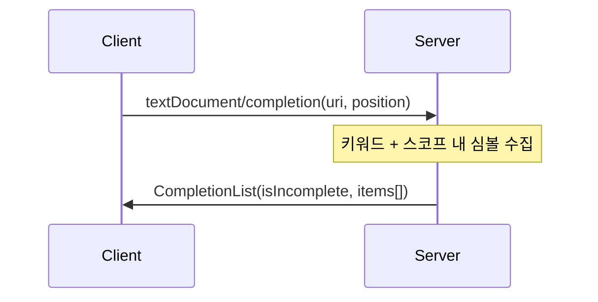

# 자동 완성(Completion) 구현하기

자동 완성은 사용자가 코드를 입력할 때 키워드, 변수, 함수 등의 후보를 제안하는 LSP의 핵심 기능이다. 코드 작성 속도를 높이고 오타를 줄이며, 사용 가능한 심볼을 쉽게 발견할 수 있게 해준다.

이 튜토리얼에서는 FunLang LSP에 Completion 기능을 구현하는 방법을 배운다.

## 목차

1. [textDocument/completion 프로토콜](#textdocumentcompletion-프로토콜)
2. [구현 전략](#구현-전략)
3. [키워드 완성](#키워드-완성)
4. [스코프 기반 심볼 완성](#스코프-기반-심볼-완성)
5. [타입 정보 표시](#타입-정보-표시)
6. [서버 통합](#서버-통합)
7. [테스트 작성](#테스트-작성)
8. [흔한 실수와 해결책](#흔한-실수와-해결책)

---

## textDocument/completion 프로토콜

### 요청 구조

클라이언트(에디터)가 자동 완성을 요청할 때 사용하는 구조이다.

```typescript
interface CompletionParams {
    textDocument: TextDocumentIdentifier  // 문서 URI
    position: Position                     // 커서 위치 (0-based)
    context?: CompletionContext           // 트리거 정보 (선택)
}

interface Position {
    line: number       // 0-based 줄 번호
    character: number  // 0-based 문자 위치
}

interface CompletionContext {
    triggerKind: CompletionTriggerKind  // 수동(1) vs 트리거 문자(2) vs 재트리거(3)
    triggerCharacter?: string            // 트리거 문자 (예: ".")
}
```

### 응답 구조

서버가 반환하는 완성 후보 목록이다.

```typescript
interface CompletionList {
    isIncomplete: boolean      // 추가 후보가 있는지 (스트리밍용)
    items: CompletionItem[]    // 완성 후보들
}

interface CompletionItem {
    label: string                        // 표시될 텍스트
    kind?: CompletionItemKind           // 아이콘 종류 (Keyword, Variable, Function 등)
    detail?: string                      // 우측 추가 정보 (예: 타입)
    documentation?: string | MarkupContent  // 상세 설명
    insertText?: string                  // 삽입될 텍스트 (기본값: label)
    insertTextFormat?: InsertTextFormat  // PlainText(1) vs Snippet(2)
    // ... 기타 필드들
}
```

### CompletionItemKind 열거형

완성 항목의 종류를 나타내며, VS Code는 각 종류마다 다른 아이콘을 표시한다.

```fsharp
type CompletionItemKind =
    | Text = 1
    | Method = 2
    | Function = 3
    | Constructor = 4
    | Field = 5
    | Variable = 6
    | Class = 7
    | Interface = 8
    | Module = 9
    | Property = 10
    | Unit = 11
    | Value = 12
    | Enum = 13
    | Keyword = 14
    // ... 더 많은 종류
```

### VS Code에서의 표시

```
test.fun
────────
let x = 42 in l█

완성 목록 팝업:
┌─────────────────────────┐
│ [키워드] let   keyword  │  ← 키워드 아이콘
│ [키워드] in    keyword  │
│ [변수]   x     x: int   │  ← 변수 아이콘, 우측에 타입
└─────────────────────────┘
```

사용자가 `l`을 입력하면:
- **필터링**: 클라이언트가 퍼지 매칭으로 `let`, `in` 등을 필터링
- **아이콘**: `CompletionItemKind`에 따라 다른 아이콘 표시
- **타입 정보**: `detail` 필드에 타입 표시



---

## 구현 전략

Completion 기능은 두 가지 소스에서 완성 후보를 제공한다:

1. **키워드 완성**: FunLang의 키워드 목록 (let, in, if, then, else 등)
2. **스코프 기반 심볼 완성**: 현재 커서 위치에서 접근 가능한 변수/함수

### 처리 흐름

```
CompletionParams 수신
    ↓
문서 텍스트 조회
    ↓
AST 파싱 시도
    ↓
    ├─ 성공 ──────────────────┐
    │                         ↓
    │                   키워드 완성 생성
    │                         ↓
    │                   스코프 심볼 수집
    │                   (collectDefinitions)
    │                         ↓
    │                   커서 이전 정의만 필터링
    │                         ↓
    │                   타입 정보 추가
    │                   (findVarTypeInAst)
    │                         ↓
    │                   심볼 완성 생성
    │                         ↓
    │                   키워드 + 심볼 병합
    │                         ↓
    └─ 실패 ────→ 키워드만 반환 (graceful degradation)
                              ↓
                   CompletionList 반환
```

### 기존 인프라 재사용

Phase 2에서 구현한 모듈들을 적극 활용한다:

- **Definition.collectDefinitions**: 모든 변수/함수 정의 위치 수집
  - 이미 AST 전체를 순회하며 바인딩 사이트를 찾음
  - Completion에서는 스코프 필터링만 추가하면 됨

- **Hover.findVarTypeInAst**: 변수의 타입 정보 조회
  - 바인딩 사이트를 찾아 값의 타입을 추론
  - Completion의 `detail` 필드에 타입 표시

### 클라이언트 필터링 위임

**중요한 설계 결정:** 서버는 모든 후보를 반환하고, 클라이언트가 필터링한다.

```fsharp
// ❌ 서버에서 prefix 필터링 (권장하지 않음)
let symbols = getSymbolsInScope ast pos
              |> List.filter (fun (name, _) -> name.StartsWith "l")

// ✅ 모든 후보 반환, 클라이언트가 퍼지 매칭
let symbols = getSymbolsInScope ast pos  // 모든 심볼
```

왜냐하면:
- VS Code는 퍼지 매칭 알고리즘 사용 (`l` → `let`, `list`, `tail` 등)
- 사용자가 타이핑할 때마다 재요청하므로 필터링은 클라이언트가 더 효율적

---

## 키워드 완성

### FunLang 키워드 목록

FunLang의 예약어를 정적 리스트로 정의한다.

```fsharp
// Completion.fs
module LangLSP.Server.Completion

open Ionide.LanguageServerProtocol.Types

/// FunLang keywords for completion
let funlangKeywords = [
    "let"; "in"; "if"; "then"; "else"; "match"; "with"
    "fun"; "rec"; "true"; "false"
]
```

**왜 정적 리스트인가?**
- Parser에서 동적으로 가져올 수도 있지만, 키워드는 거의 변하지 않음
- 간단하고 명확한 구현
- Phase 3 MVP에 충분

### 키워드 CompletionItem 생성

```fsharp
/// Create completion items for keywords
let getKeywordCompletions () : CompletionItem list =
    funlangKeywords
    |> List.map (fun kw ->
        {
            Label = kw
            LabelDetails = None
            Kind = Some CompletionItemKind.Keyword
            Detail = Some "keyword"
            Documentation = None
            Deprecated = Some false
            Preselect = Some false
            SortText = None
            FilterText = None
            InsertText = Some kw
            InsertTextFormat = Some InsertTextFormat.PlainText
            InsertTextMode = None
            TextEdit = None
            TextEditText = None
            AdditionalTextEdits = None
            CommitCharacters = None
            Command = None
            Data = None
            Tags = None
        })
```

### 주요 필드 설명

| 필드 | 값 | 설명 |
|------|-----|------|
| `Label` | `"let"` | 완성 목록에 표시될 텍스트 |
| `Kind` | `CompletionItemKind.Keyword` | 키워드 아이콘 표시 |
| `Detail` | `"keyword"` | 우측에 표시될 추가 정보 |
| `InsertText` | `"let"` | 선택 시 삽입될 텍스트 (기본값: Label) |
| `InsertTextFormat` | `PlainText` | 일반 텍스트 (Snippet은 `$1`, `${2:name}` 같은 플레이스홀더) |

**생략 가능한 필드:**
- `Documentation`: 키워드 설명은 Hover에서 제공
- `SortText`: 기본 알파벳 정렬 사용
- `FilterText`: Label과 동일하게 사용됨

---

## 스코프 기반 심볼 완성

### Definition.collectDefinitions 재사용

Phase 2의 Go to Definition에서 구현한 함수를 그대로 사용한다.

```fsharp
// Definition.fs에서 이미 구현됨
let collectDefinitions (ast: Expr) : (string * Span) list
```

이 함수는:
- AST를 재귀적으로 순회
- `Let`, `LetRec`, `Lambda`, `Match` 등의 바인딩 사이트 수집
- `(변수명, Span)` 쌍의 리스트 반환

### 스코프 필터링

**핵심:** 커서 위치 **이전**에 정의된 심볼만 포함해야 한다.

```fsharp
/// Get symbol completions from current scope
/// Filters to symbols defined before cursor position
let getSymbolCompletions (ast: Expr) (pos: Position) : CompletionItem list =
    let definitions = Definition.collectDefinitions ast

    // Filter to symbols defined before cursor position (scope filtering)
    let inScope =
        definitions
        |> List.filter (fun (_, span) ->
            // 커서보다 앞에 정의된 것만
            span.StartLine < int pos.Line ||
            (span.StartLine = int pos.Line && span.StartColumn < int pos.Character))
        // 섀도잉 처리: 중복 이름은 마지막 정의만 유지
        |> List.rev
        |> List.distinctBy fst
        |> List.rev
```

### 섀도잉 처리

같은 이름이 여러 번 정의되면 마지막 정의가 유효하다.

```fsharp
// 예시 코드
let x = 1 in
let x = 2 in
let x = 3 in
x + █   // 여기서 x는 3을 의미
```

`collectDefinitions`는 세 개의 `("x", span)` 항목을 반환한다.
`List.distinctBy fst`로 중복을 제거하면 **마지막 `x`만 남는다**.

```fsharp
// 섀도잉 처리 단계별 설명
definitions = [("x", span1); ("x", span2); ("x", span3)]
  |> List.rev                 // [("x", span3); ("x", span2); ("x", span1)]
  |> List.distinctBy fst      // [("x", span3)]  ← 첫 번째 x만 남음 (rev 후라 실제로는 마지막)
  |> List.rev                 // [("x", span3)]
```

---

## 타입 정보 표시

### Hover.findVarTypeInAst 재사용

Phase 2의 Hover에서 구현한 함수를 사용한다.

```fsharp
// Hover.fs에서 이미 구현됨
let findVarTypeInAst (varName: string) (ast: Expr) : Type.Type option
```

이 함수는:
- AST를 순회하며 변수의 바인딩 사이트 찾기
- 바인딩된 값의 타입 추론
- 타입 어노테이션이 있으면 그것 사용

### 타입 정보가 포함된 CompletionItem 생성

```fsharp
// Create completion items with type information
inScope
|> List.map (fun (name, span) ->
    // Try to get type for this symbol
    let typeInfo = Hover.findVarTypeInAst name ast

    let detail =
        match typeInfo with
        | Some ty -> Some (sprintf "%s: %s" name (Type.formatTypeNormalized ty))
        | None -> Some name

    {
        Label = name
        LabelDetails = None
        Kind = Some CompletionItemKind.Variable
        Detail = detail
        Documentation = None
        Deprecated = Some false
        Preselect = Some false
        SortText = None
        FilterText = None
        InsertText = Some name
        InsertTextFormat = Some InsertTextFormat.PlainText
        InsertTextMode = None
        TextEdit = None
        TextEditText = None
        AdditionalTextEdits = None
        CommitCharacters = None
        Command = None
        Data = None
        Tags = None
    })
```

### Detail 필드 형식

```
VS Code 완성 목록:
┌────────────────────────────┐
│ [변수] x     x: int        │  ← detail: "x: int"
│ [변수] double  double: int -> int │
│ [변수] id    id: 'a -> 'a  │  ← 다형 타입
└────────────────────────────┘
```

**Type.formatTypeNormalized의 역할:**
- `TInt` → `"int"`
- `TFunc(TInt, TInt)` → `"int -> int"`
- `TVar(1000)` → `"'a"` (타입 변수 정규화)
- `TTuple([TInt; TBool])` → `"int * bool"`

### Variable vs Function 구분

Phase 3에서는 모든 심볼을 `CompletionItemKind.Variable`로 표시한다.

```fsharp
Kind = Some CompletionItemKind.Variable  // 함수도 Variable로 표시
```

**왜?**
- FunLang에서 함수도 일급 값(first-class value)
- 타입이 `TArrow`인지 확인하면 Function으로 구분 가능하지만, Phase 3은 단순하게 유지
- Phase 4에서 타입 기반 구분 추가 가능

---

## 서버 통합

### handleCompletion 메인 함수

전체 로직을 조합한 핸들러이다.

```fsharp
/// Handle textDocument/completion request
let handleCompletion (p: CompletionParams) : Async<CompletionList option> =
    async {
        let uri = p.TextDocument.Uri
        let pos = p.Position

        match getDocument uri with
        | None -> return None
        | Some text ->
            try
                let lexbuf = FSharp.Text.Lexing.LexBuffer<char>.FromString(text)
                let ast = Parser.start Lexer.tokenize lexbuf

                let keywords = getKeywordCompletions()
                let symbols = getSymbolCompletions ast pos

                return Some {
                    IsIncomplete = false
                    Items = (keywords @ symbols) |> Array.ofList
                    ItemDefaults = None
                }
            with _ ->
                // On parse error, return only keywords (graceful degradation)
                return Some {
                    IsIncomplete = false
                    Items = getKeywordCompletions() |> Array.ofList
                    ItemDefaults = None
                }
    }
```

### 주요 설계 결정

**1. Graceful Degradation (우아한 성능 저하)**

파싱 에러가 발생해도 키워드는 제공한다.

```fsharp
with _ ->
    // AST 없어도 키워드는 사용 가능
    return Some {
        IsIncomplete = false
        Items = getKeywordCompletions() |> Array.ofList
        ItemDefaults = None
    }
```

**사용자 시나리오:**
```fsharp
let x = 1 i█    // 사용자가 'in'을 타이핑 중 (아직 불완전)
```
- 파싱 실패 (불완전한 구문)
- 하지만 `in` 키워드는 여전히 제안됨
- 사용자 경험 향상

**2. IsIncomplete = false**

Phase 3에서는 모든 후보를 한 번에 반환한다.

```fsharp
IsIncomplete = false  // 추가 후보 없음
```

`IsIncomplete = true`는 언제 사용?
- 심볼 테이블이 매우 큰 경우 (수천 개 이상)
- 스트리밍 방식으로 점진적 로딩
- FunLang은 단일 파일이라 필요 없음

**3. 트리거 문자 없음**

Phase 3에서는 사용자가 명시적으로 완성을 호출한다 (Ctrl+Space).

```fsharp
// Server.fs
CompletionProvider = Some {
    ResolveProvider = Some false
    TriggerCharacters = None  // Phase 3: 트리거 문자 없음
    AllCommitCharacters = None
    WorkDoneProgress = None
}
```

트리거 문자 (`.`, `::` 등)는 Phase 4에서 추가 가능.

### Server.fs 등록

```fsharp
// Server.fs
module LangLSP.Server.Server

open Ionide.LanguageServerProtocol.Server
open Ionide.LanguageServerProtocol.Types

type FunLangLspServer() =
    inherit LspServer()

    override this.Initialize(p: InitializeParams) =
        async {
            return {
                Capabilities = {
                    TextDocumentSync = Some {
                        OpenClose = Some true
                        Change = Some TextDocumentSyncKind.Full
                        WillSave = None
                        WillSaveWaitUntil = None
                        Save = None
                    }
                    DefinitionProvider = Some (U2.C1 true)
                    HoverProvider = Some (U2.C1 true)
                    CompletionProvider = Some {
                        ResolveProvider = Some false
                        TriggerCharacters = None
                        AllCommitCharacters = None
                        WorkDoneProgress = None
                    }
                    // ... 다른 capabilities
                }
            }
        }

    override this.TextDocumentCompletion(p: CompletionParams) =
        async {
            let! result = Completion.handleCompletion p
            return result
        }
```

---

## 테스트 작성

### 테스트 헬퍼 함수

```fsharp
// CompletionTests.fs
module LangLSP.Tests.CompletionTests

open Expecto
open Ionide.LanguageServerProtocol.Types
open LangLSP.Server.Completion
open LangLSP.Server.DocumentSync

/// CompletionParams 생성 헬퍼
let makeCompletionParams uri line char : CompletionParams =
    {
        TextDocument = { Uri = uri }
        Position = { Line = uint32 line; Character = uint32 char }
        Context = None  // 트리거 컨텍스트 없음
        WorkDoneToken = None
        PartialResultToken = None
    }

/// 문서 설정 후 completion 수행
let setupAndComplete uri text line char =
    clearAll()  // 문서 저장소 초기화
    handleDidOpen (makeDidOpenParams uri text)
    handleCompletion (makeCompletionParams uri line char) |> Async.RunSynchronously

/// CompletionList에서 label 추출
let getCompletionLabels (result: CompletionList option) : string list =
    result
    |> Option.map (fun list -> list.Items |> Array.map (fun item -> item.Label) |> Array.toList)
    |> Option.defaultValue []
```

### 키워드 완성 테스트

```fsharp
[<Tests>]
let completionTests = testList "Completion" [
    testList "Keyword completion" [
        testCase "includes all FunLang keywords" <| fun _ ->
            let result = setupAndComplete "file:///test.fun" "" 0 0
            let labels = getCompletionLabels result

            Expect.contains labels "let" "Should include 'let'"
            Expect.contains labels "in" "Should include 'in'"
            Expect.contains labels "if" "Should include 'if'"
            Expect.contains labels "fun" "Should include 'fun'"
            Expect.contains labels "match" "Should include 'match'"

        testCase "keywords have Keyword kind" <| fun _ ->
            let result = setupAndComplete "file:///test.fun" "" 0 0
            match result with
            | Some list ->
                let letItem = list.Items |> Array.find (fun item -> item.Label = "let")
                Expect.equal letItem.Kind (Some CompletionItemKind.Keyword) "Should be Keyword kind"
            | None -> failtest "Expected completion result"

        testCase "keywords returned on parse error" <| fun _ ->
            // 불완전한 코드에서도 키워드는 제공됨
            let result = setupAndComplete "file:///test.fun" "let x =" 0 7
            let labels = getCompletionLabels result
            Expect.contains labels "let" "Should include keywords even on parse error"
    ]
]
```

### 심볼 완성 테스트

```fsharp
    testList "Symbol completion" [
        testCase "includes variable in scope" <| fun _ ->
            let text = "let x = 42 in x"
            let result = setupAndComplete "file:///test.fun" text 0 14
            let labels = getCompletionLabels result
            Expect.contains labels "x" "Should include variable x"

        testCase "includes function in scope" <| fun _ ->
            let text = "let double = fun x -> x * 2 in double 5"
            let result = setupAndComplete "file:///test.fun" text 0 31
            let labels = getCompletionLabels result
            Expect.contains labels "double" "Should include function double"

        testCase "symbols have Variable kind" <| fun _ ->
            let text = "let x = 42 in x"
            let result = setupAndComplete "file:///test.fun" text 0 14
            match result with
            | Some list ->
                let xItem = list.Items |> Array.tryFind (fun item -> item.Label = "x")
                match xItem with
                | Some item ->
                    Expect.equal item.Kind (Some CompletionItemKind.Variable) "Should be Variable kind"
                | None -> failtest "Expected x in completion items"
            | None -> failtest "Expected completion result"
    ]
```

### 스코프 필터링 테스트

```fsharp
    testList "Scope filtering" [
        testCase "excludes variable defined after cursor" <| fun _ ->
            let text = "let x = (let y = 1 in y) in x"
            // 커서가 let y 전 (괄호 다음)
            let result = setupAndComplete "file:///test.fun" text 0 9
            let labels = getCompletionLabels result
            Expect.isFalse (labels |> List.contains "y") "Should not include y (not in scope yet)"

        testCase "includes variable defined before cursor" <| fun _ ->
            let text = "let x = 42 in let y = x + 1 in y"
            // 커서가 y 정의 내부 (x + 1 부분)
            let result = setupAndComplete "file:///test.fun" text 0 24
            let labels = getCompletionLabels result
            Expect.contains labels "x" "Should include x (defined before)"

        testCase "shadowing: uses most recent definition" <| fun _ ->
            let text = "let x = 1 in let x = 2 in x"
            let result = setupAndComplete "file:///test.fun" text 0 26
            let labels = getCompletionLabels result
            // x는 한 번만 나타나야 함 (섀도잉)
            let xCount = labels |> List.filter ((=) "x") |> List.length
            Expect.equal xCount 1 "Should have only one x in completion"
    ]
```

### 타입 정보 테스트

```fsharp
    testList "Type information" [
        testCase "shows type for integer variable" <| fun _ ->
            let text = "let x = 42 in x"
            let result = setupAndComplete "file:///test.fun" text 0 14
            match result with
            | Some list ->
                let xItem = list.Items |> Array.tryFind (fun item -> item.Label = "x")
                match xItem with
                | Some item ->
                    match item.Detail with
                    | Some detail ->
                        Expect.stringContains detail "int" "Should show int type"
                    | None -> failtest "Expected detail with type"
                | None -> failtest "Expected x in completion items"
            | None -> failtest "Expected completion result"

        testCase "shows type for function" <| fun _ ->
            let text = "let double = fun x -> x * 2 in double 5"
            let result = setupAndComplete "file:///test.fun" text 0 31
            match result with
            | Some list ->
                let doubleItem = list.Items |> Array.tryFind (fun item -> item.Label = "double")
                match doubleItem with
                | Some item ->
                    match item.Detail with
                    | Some detail ->
                        Expect.stringContains detail "int -> int" "Should show function type"
                    | None -> failtest "Expected detail with type"
                | None -> failtest "Expected double in completion items"
            | None -> failtest "Expected completion result"

        testCase "shows polymorphic type" <| fun _ ->
            let text = "let id = fun x -> x in id"
            let result = setupAndComplete "file:///test.fun" text 0 23
            match result with
            | Some list ->
                let idItem = list.Items |> Array.tryFind (fun item -> item.Label = "id")
                match idItem with
                | Some item ->
                    match item.Detail with
                    | Some detail ->
                        Expect.stringContains detail "'a" "Should show polymorphic type"
                    | None -> failtest "Expected detail with type"
                | None -> failtest "Expected id in completion items"
            | None -> failtest "Expected completion result"
    ]
] |> testSequenced  // 공유 상태로 인해 순차 실행
```

### 테스트 실행

```bash
dotnet test src/LangLSP.Tests

# 결과:
# [Completion/Keyword completion] includes all FunLang keywords - Passed
# [Completion/Keyword completion] keywords have Keyword kind - Passed
# [Completion/Keyword completion] keywords returned on parse error - Passed
# [Completion/Symbol completion] includes variable in scope - Passed
# [Completion/Symbol completion] includes function in scope - Passed
# [Completion/Symbol completion] symbols have Variable kind - Passed
# [Completion/Scope filtering] excludes variable defined after cursor - Passed
# [Completion/Scope filtering] includes variable defined before cursor - Passed
# [Completion/Scope filtering] shadowing: uses most recent definition - Passed
# [Completion/Type information] shows type for integer variable - Passed
# [Completion/Type information] shows type for function - Passed
# [Completion/Type information] shows polymorphic type - Passed
```

---

## 흔한 실수와 해결책

### 1. CompletionList vs CompletionItem[] 혼동

**증상:** 완성 목록이 VS Code에 표시되지 않음

**원인:** LSP 스펙은 두 가지 반환 타입을 허용하지만, Ionide는 `CompletionList option` 사용

```fsharp
// ❌ 잘못된 방법 (배열 반환)
let handleCompletion (p: CompletionParams) : Async<CompletionItem[] option> =
    async {
        let items = getKeywordCompletions() |> Array.ofList
        return Some items  // 타입 불일치!
    }

// ✅ 올바른 방법 (CompletionList 반환)
let handleCompletion (p: CompletionParams) : Async<CompletionList option> =
    async {
        return Some {
            IsIncomplete = false
            Items = getKeywordCompletions() |> Array.ofList
            ItemDefaults = None
        }
    }
```

### 2. 0-based vs 1-based 좌표 혼동

**증상:** 완성 목록에 스코프 외 변수가 포함되거나 스코프 내 변수가 누락됨

**원인:** FsLexYacc 문서는 1-based라고 하지만 `LexBuffer.FromString`은 0-based!

```fsharp
// ❌ 잘못된 방법 (1-based로 가정)
span.StartLine < int pos.Line - 1  // 불필요한 -1

// ✅ 올바른 방법 (0-based 직접 사용)
span.StartLine < int pos.Line  // LSP와 FunLang 모두 0-based
```

**검증 방법:**
```fsharp
// 첫 줄, 첫 문자는 (0, 0)
let text = "let x = 42"
let pos = { Line = 0u; Character = 0u }  // 첫 위치
```

### 3. 스코프 외 심볼 포함

**증상:** 아직 정의되지 않은 변수가 완성 목록에 나타남

**원인:** 스코프 필터링 누락

```fsharp
// ❌ 잘못된 방법 (모든 심볼 반환)
let getSymbolCompletions (ast: Expr) (pos: Position) =
    Definition.collectDefinitions ast  // 위치 필터링 없음
    |> List.map createCompletionItem

// ✅ 올바른 방법 (커서 이전 정의만)
let getSymbolCompletions (ast: Expr) (pos: Position) =
    Definition.collectDefinitions ast
    |> List.filter (fun (_, span) ->
        span.StartLine < int pos.Line ||
        (span.StartLine = int pos.Line && span.StartColumn < int pos.Character))
    |> List.map createCompletionItem
```

### 4. 타입 정보 누락

**증상:** 완성 항목에 타입이 표시되지 않음

**원인:** `findVarTypeInAst` 호출 누락

```fsharp
// ❌ 잘못된 방법 (타입 정보 없음)
let detail = Some name  // 이름만 표시

// ✅ 올바른 방법 (타입 정보 추가)
let typeInfo = Hover.findVarTypeInAst name ast
let detail =
    match typeInfo with
    | Some ty -> Some (sprintf "%s: %s" name (Type.formatTypeNormalized ty))
    | None -> Some name
```

**주의:** 타입 추론 실패는 정상적인 상황이다 (람다 매개변수 등). None을 반환해도 문제없다.

### 5. 트리거 문자 설정 문제

**증상:** 자동 완성이 `.` 입력 시 작동하지 않거나 너무 자주 트리거됨

**원인:** Phase 3은 트리거 문자를 지원하지 않음

```fsharp
// ❌ Phase 3에서 트리거 문자 추가 (권장하지 않음)
CompletionProvider = Some {
    ResolveProvider = Some false
    TriggerCharacters = Some [| "." |]  // 추가 필터링 로직 필요
    // ...
}

// ✅ Phase 3에서는 수동 호출만
CompletionProvider = Some {
    ResolveProvider = Some false
    TriggerCharacters = None  // 명시적으로 None
    // ...
}
```

트리거 문자는 컨텍스트에 따른 필터링이 필요하다:
- `.` 입력 후 → 레코드/모듈 멤버만 표시
- `::` 입력 후 → 리스트 관련 심볼만 표시

Phase 4에서 추가 가능.

### 6. 섀도잉 처리 누락

**증상:** 같은 변수 이름이 여러 번 완성 목록에 나타남

**원인:** `List.distinctBy` 누락

```fsharp
// ❌ 잘못된 방법 (중복 포함)
definitions
|> List.filter (fun (_, span) -> (* 스코프 체크 *))
|> List.map createCompletionItem

// ✅ 올바른 방법 (중복 제거)
definitions
|> List.filter (fun (_, span) -> (* 스코프 체크 *))
|> List.rev
|> List.distinctBy fst  // 마지막 정의만 유지
|> List.rev
|> List.map createCompletionItem
```

### 7. 파싱 에러 시 빈 목록 반환

**증상:** 불완전한 코드 입력 시 아무 완성도 표시되지 않음

**원인:** 예외 처리에서 None 반환

```fsharp
// ❌ 잘못된 방법 (파싱 실패 시 빈 결과)
try
    let ast = Parser.start Lexer.tokenize lexbuf
    // ...
with _ ->
    return None  // 아무것도 안 보임!

// ✅ 올바른 방법 (키워드라도 제공)
try
    let ast = Parser.start Lexer.tokenize lexbuf
    // ...
with _ ->
    // Graceful degradation: 키워드는 항상 유효
    return Some {
        IsIncomplete = false
        Items = getKeywordCompletions() |> Array.ofList
        ItemDefaults = None
    }
```

---

## 정리

Completion 구현의 핵심 포인트:

1. **두 가지 소스**: 키워드 (정적 리스트) + 심볼 (AST에서 수집)
2. **기존 인프라 재사용**:
   - `Definition.collectDefinitions`로 심볼 수집
   - `Hover.findVarTypeInAst`로 타입 정보 추가
3. **스코프 필터링**: 커서 이전에 정의된 심볼만 포함
4. **섀도잉 처리**: `List.distinctBy`로 중복 제거
5. **Graceful Degradation**: 파싱 실패 시 키워드만 반환
6. **클라이언트 필터링**: 서버는 모든 후보 반환, 클라이언트가 퍼지 매칭

---

## 다음 단계

Completion 구현으로 Phase 3이 완료된다!

Phase 4에서는:
- **Find References**: 심볼이 사용된 모든 위치 찾기
- **Rename**: 심볼 이름을 프로젝트 전체에서 일괄 변경
- **Code Actions**: Quick Fix 제안 (예: 타입 어노테이션 추가)

고급 Completion 기능:
- **트리거 문자**: `.`, `::` 입력 시 컨텍스트 기반 완성
- **CompletionItem/resolve**: 지연 로딩으로 상세 정보 제공
- **Snippet 지원**: `fun $1 -> $0` 같은 플레이스홀더

---

## 참고 자료

- [LSP Specification - textDocument/completion](https://microsoft.github.io/language-server-protocol/specifications/lsp/3.17/specification/#textDocument_completion)
- [Ionide.LanguageServerProtocol - CompletionParams/CompletionList](https://github.com/ionide/LanguageServerProtocol)
- [FsAutoComplete - CompletionTests.fs](https://github.com/ionide/FsAutoComplete/blob/main/test/FsAutoComplete.Tests.Lsp/CompletionTests.fs)
- [Making an LSP for great good - Completion](https://thunderseethe.dev/posts/lsp-base/)
