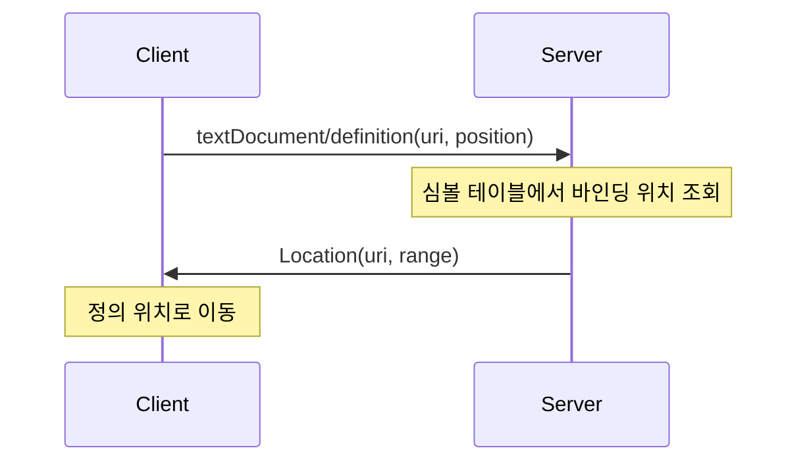

# Go to Definition 구현하기

이 문서는 LSP 서버에서 **Go to Definition** 기능을 구현하는 방법을 설명합니다. 변수나 함수를 클릭하고 "Go to Definition"을 실행하면 해당 심볼이 정의된 위치로 이동합니다. 이 기능은 코드 네비게이션의 핵심으로, 대규모 코드베이스에서 특히 유용합니다.

## 목차

1. [Go to Definition이란](#go-to-definition이란)
2. [LSP 프로토콜](#lsp-프로토콜)
3. [심볼 테이블](#심볼-테이블)
4. [FunLang의 바인딩 위치](#funlang의-바인딩-위치)
5. [정의 수집 구현](#정의-수집-구현)
6. [변수 섀도잉 처리](#변수-섀도잉-처리)
7. [식별자 위치 정확히 찾기](#식별자-위치-정확히-찾기)
8. [핸들러 구현](#핸들러-구현)
9. [Server.fs 통합](#serverfs-통합)
10. [테스트 작성](#테스트-작성)
11. [싱글 파일 vs 멀티 파일](#싱글-파일-vs-멀티-파일)

---

## Go to Definition이란

**Go to Definition**은 변수나 함수 이름 위에서 트리거하면 해당 심볼이 **처음 정의된 위치**로 이동하는 기능입니다.

### VS Code에서의 사용

```
test.fun
────────
1 | let add = fun x -> fun y -> x + y in
2 | let result = add 1 2 in
        ^^^
        [F12] 또는 [Ctrl+클릭]
        → 1번 라인의 "add" 정의로 이동
```

**트리거 방법:**
- `F12` 키
- `Ctrl+클릭` (Windows/Linux) 또는 `Cmd+클릭` (Mac)
- 우클릭 → "Go to Definition"

### 핵심 동작

1. 사용자가 커서를 변수 위에 놓음
2. 클라이언트가 `textDocument/definition` 요청 전송
3. 서버가 해당 변수의 **정의 위치** 반환
4. 클라이언트가 해당 위치로 커서 이동



---

## LSP 프로토콜

### textDocument/definition 요청

```typescript
interface DefinitionParams {
    textDocument: TextDocumentIdentifier  // { uri: "file:///test.fun" }
    position: Position                     // { line: 1, character: 13 }
}
```

**요청 예시:**
```json
{
    "jsonrpc": "2.0",
    "id": 5,
    "method": "textDocument/definition",
    "params": {
        "textDocument": { "uri": "file:///test.fun" },
        "position": { "line": 1, "character": 13 }
    }
}
```

### 응답 형식

LSP는 세 가지 응답 형식을 지원합니다:

| 형식 | 언제 사용 | 예시 |
|------|----------|------|
| `Location` | 정의가 하나일 때 | 일반적인 변수/함수 |
| `Location[]` | 정의가 여러 개일 때 | 오버로딩, 여러 파일 |
| `LocationLink[]` | 추가 컨텍스트 필요할 때 | 정의 범위 강조 |

FunLang은 **싱글 파일 + 단일 정의**이므로 `Location`만 사용합니다.

### Location 구조

```typescript
interface Location {
    uri: string   // 파일 경로 (예: "file:///test.fun")
    range: Range  // 정의 위치 { start: {line, character}, end: {line, character} }
}
```

**응답 예시:**
```json
{
    "jsonrpc": "2.0",
    "id": 5,
    "result": {
        "uri": "file:///test.fun",
        "range": {
            "start": { "line": 0, "character": 4 },
            "end": { "line": 0, "character": 7 }
        }
    }
}
```

---

## 심볼 테이블

Go to Definition을 구현하려면 **"어떤 변수가 어디서 정의되었는지"** 알아야 합니다. 이를 위해 **심볼 테이블(Symbol Table)**을 구축합니다.

### 개념

심볼 테이블은 변수/함수 이름을 정의 위치에 매핑하는 자료구조입니다:

```
| 이름   | 정의 위치 (Span)       |
|--------|----------------------|
| add    | (0, 4) - (0, 7)     |
| x      | (0, 15) - (0, 16)   |
| y      | (0, 24) - (0, 25)   |
| result | (1, 4) - (1, 10)    |
```

### 구현 방식

FunLang LSP에서는 AST를 순회하며 모든 바인딩 위치를 수집합니다:

```fsharp
// (변수명, Span) 쌍의 리스트
let collectDefinitions (ast: Expr) : (string * Span) list
```

**왜 리스트인가?**
- 같은 이름의 변수가 여러 번 정의될 수 있음 (섀도잉)
- Dictionary보다 리스트가 섀도잉 처리에 유리

---

## FunLang의 바인딩 위치

FunLang에서 변수가 **정의**되는 곳을 모두 파악해야 합니다.

### 1. let 바인딩

```funlang
let x = 42 in x + 1
    ^
    정의 위치
```

```fsharp
| Let(name, value, body, span) ->
    // name이 정의됨, span이 정의 위치
    defs.Add(name, span)
```

### 2. let rec 바인딩 (재귀 함수)

```funlang
let rec fact n = if n = 0 then 1 else n * fact (n - 1) in fact 5
        ^^^^
        정의 위치 (함수명)
             ^
             정의 위치 (파라미터)
```

`let rec`은 **두 가지** 바인딩을 생성합니다:
1. 함수 이름 (`fact`)
2. 파라미터 (`n`)

```fsharp
| LetRec(name, param, fnBody, inExpr, span) ->
    defs.Add(name, span)   // 함수명
    defs.Add(param, span)  // 파라미터
```

### 3. 람다 파라미터

```funlang
fun x -> x + 1
    ^
    정의 위치
```

```fsharp
| Lambda(param, body, span) ->
    defs.Add(param, span)

| LambdaAnnot(param, _, body, span) ->
    defs.Add(param, span)
```

### 4. 패턴 매칭

```funlang
match xs with
| h::t -> h + length t
  ^ ^
  정의 위치 (h, t)

let (x, y) = (1, 2) in x + y
    ^  ^
    정의 위치 (x, y)
```

패턴에서 바인딩되는 변수들:

```fsharp
let rec collectPatternBindings pattern =
    match pattern with
    | VarPat(name, span) ->
        defs.Add(name, span)
    | TuplePat(pats, _) ->
        pats |> List.iter collectPatternBindings
    | ConsPat(head, tail, _) ->
        collectPatternBindings head
        collectPatternBindings tail
    | WildcardPat _ | EmptyListPat _ | ConstPat _ ->
        ()  // 바인딩 없음
```

---

## 정의 수집 구현

실제 구현은 `Definition.fs`에 있습니다.

### collectDefinitions 함수

```fsharp
// Definition.fs
module LangLSP.Server.Definition

open Ast

/// Collect all variable/function definitions while traversing AST
/// Returns list of (name, span) pairs for all binding sites
let collectDefinitions (ast: Expr) : (string * Span) list =
    let defs = ResizeArray<string * Span>()

    let rec traverse expr =
        match expr with
        | Let(name, value, body, span) ->
            defs.Add(name, span)
            traverse value
            traverse body

        | LetRec(name, param, fnBody, inExpr, span) ->
            defs.Add(name, span)
            defs.Add(param, span)
            traverse fnBody
            traverse inExpr

        | Lambda(param, body, span) ->
            defs.Add(param, span)
            traverse body

        | LambdaAnnot(param, _, body, span) ->
            defs.Add(param, span)
            traverse body

        | LetPat(pattern, value, body, _) ->
            collectPatternBindings pattern
            traverse value
            traverse body

        | Match(scrutinee, clauses, _) ->
            traverse scrutinee
            for (pattern, clauseBody) in clauses do
                collectPatternBindings pattern
                traverse clauseBody

        // 이항 연산자: 양쪽 모두 순회
        | Add(l, r, _) | Subtract(l, r, _) | Multiply(l, r, _) | Divide(l, r, _)
        | Equal(l, r, _) | NotEqual(l, r, _) | LessThan(l, r, _) | GreaterThan(l, r, _)
        | LessEqual(l, r, _) | GreaterEqual(l, r, _) | And(l, r, _) | Or(l, r, _)
        | Cons(l, r, _) | App(l, r, _) ->
            traverse l
            traverse r

        // 단항 연산자
        | Negate(e, _) | Annot(e, _, _) ->
            traverse e

        // 컬렉션
        | Tuple(exprs, _) | List(exprs, _) ->
            exprs |> List.iter traverse

        // 조건문
        | If(cond, thenExpr, elseExpr, _) ->
            traverse cond
            traverse thenExpr
            traverse elseExpr

        // 리프 노드: 바인딩 없음
        | Number _ | Bool _ | String _ | Var _ | EmptyList _ -> ()

    and collectPatternBindings pattern =
        match pattern with
        | VarPat(name, span) -> defs.Add(name, span)
        | TuplePat(pats, _) -> pats |> List.iter collectPatternBindings
        | ConsPat(head, tail, _) ->
            collectPatternBindings head
            collectPatternBindings tail
        | WildcardPat _ | EmptyListPat _ | ConstPat _ -> ()

    traverse ast
    defs |> Seq.toList
```

### 주요 포인트

1. **ResizeArray 사용**: F#의 mutable 리스트, 효율적인 추가 연산
2. **재귀 순회**: 모든 하위 표현식까지 탐색
3. **패턴 처리**: `collectPatternBindings`로 패턴 내 바인딩 수집
4. **Span 활용**: FunLang AST의 모든 노드는 소스 위치(Span)를 가짐

---

## 변수 섀도잉 처리

같은 이름의 변수가 여러 번 정의될 수 있습니다.

### 문제 상황

```funlang
let x = 1 in
  let x = 2 in
    x
    ^
    여기서 x는 어느 정의를 가리킬까요?
```

**정답:** 가장 가까운(내부) 정의인 `let x = 2`입니다.

### 스코프 규칙

FunLang은 **렉시컬 스코핑(Lexical Scoping)**을 사용합니다:
- 변수 사용 위치에서 가장 가까운 바깥쪽 정의를 참조
- 내부 정의가 외부 정의를 "가림(shadow)"

### 구현 전략

```fsharp
/// Find definition span for a variable reference
/// For shadowing: returns the definition that appears last before usage position
let findDefinitionForVar (varName: string) (ast: Expr) (usagePos: Position) : Span option =
    let defs = collectDefinitions ast
                |> List.filter (fun (name, _) -> name = varName)

    // 사용 위치 이전에 정의된 것 중 가장 나중에 나온 것 선택
    let usageLine = int usagePos.Line
    let usageCol = int usagePos.Character

    defs
    |> List.filter (fun (_, span) ->
        // 정의 위치가 사용 위치 이전인 것만
        span.StartLine < usageLine ||
        (span.StartLine = usageLine && span.StartColumn <= usageCol))
    |> List.sortByDescending (fun (_, span) -> span.StartLine, span.StartColumn)
    |> List.tryHead
    |> Option.map snd
```

### 알고리즘 설명

1. **이름으로 필터링**: 같은 이름의 정의만 선택
2. **위치 조건**: 사용 위치 **이전**에 정의된 것만 선택
3. **가장 나중 것 선택**: `sortByDescending`으로 가장 가까운 정의 선택

### 예시

```funlang
let x = 1 in      (* 정의 1: line 0, col 4 *)
  let x = 2 in    (* 정의 2: line 1, col 6 *)
    x             (* 사용: line 2, col 4 *)
```

사용 위치 (line 2, col 4)에서:
1. `x` 정의 목록: [(x, 0:4), (x, 1:6)]
2. 사용 위치 이전 정의: 둘 다 해당
3. 가장 나중 정의: (x, 1:6) 선택

---

## 식별자 위치 정확히 찾기

`collectDefinitions`가 수집하는 Span은 전체 표현식의 범위입니다 (예: `let x = 42 in x + 1` 전체). Go to Definition에서는 **식별자 이름의 정확한 위치**만 반환해야 합니다.

### findIdentifierRange 함수

```fsharp
/// Find the exact range of an identifier name in source text near a span
let findIdentifierRange (text: string) (name: string) (span: Span) : Range =
    let lines = text.Split('\n')
    if span.StartLine < lines.Length then
        let line = lines.[span.StartLine]
        let idx = line.IndexOf(name, span.StartColumn)
        if idx >= 0 then
            { Start = { Line = uint32 span.StartLine; Character = uint32 idx }
              End = { Line = uint32 span.StartLine; Character = uint32 (idx + name.Length) } }
        else
            spanToLspRange span
    else
        spanToLspRange span
```

**핵심 로직:**
1. Span의 시작 라인에서 해당 이름을 검색
2. `IndexOf(name, span.StartColumn)`로 Span 시작 위치 이후에서 이름 찾기
3. 찾으면 이름의 정확한 시작/끝 위치 반환
4. 못 찾으면 fallback으로 전체 Span 사용

이 함수는 Diagnostics의 미사용 변수 범위에서도 재사용됩니다.

---

## 핸들러 구현

### handleDefinition 함수

```fsharp
// Definition.fs
open Ionide.LanguageServerProtocol.Types
open LangLSP.Server.AstLookup
open LangLSP.Server.DocumentSync
open LangLSP.Server.Protocol

/// Handle textDocument/definition request
/// Returns Definition.C1 for single location (single-file scope)
let handleDefinition (p: DefinitionParams) : Async<Definition option> =
    async {
        let uri = p.TextDocument.Uri
        let pos = p.Position

        match getDocument uri with
        | None -> return None
        | Some text ->
            try
                // 1. 파싱
                let lexbuf = FSharp.Text.Lexing.LexBuffer<char>.FromString(text)
                let ast = Parser.start Lexer.tokenize lexbuf

                // 2. 커서 위치의 노드 찾기
                match findNodeAtPosition pos ast with
                | None -> return None
                | Some node ->
                    match node with
                    | Var(name, _) ->
                        // 3. 해당 변수의 정의 찾기
                        match findDefinitionForVar name ast pos with
                        | None -> return None
                        | Some defSpan ->
                            // 4. Location 반환 (식별자 이름 위치만 정확히 타겟팅)
                            let location : Location = {
                                Uri = uri
                                Range = findIdentifierRange text name defSpan
                            }
                            return Some (U2.C1 location)
                    | _ ->
                        // 변수 참조가 아님 (숫자, 연산자 등)
                        return None
            with _ ->
                // 파싱 실패
                return None
    }
```

### 동작 흐름

```
사용자 F12 키
     │
     ▼
┌─────────────────────────────────────┐
│ 1. getDocument로 소스 텍스트 획득   │
└─────────────────────────────────────┘
     │
     ▼
┌─────────────────────────────────────┐
│ 2. Parser로 AST 생성                │
└─────────────────────────────────────┘
     │
     ▼
┌─────────────────────────────────────┐
│ 3. findNodeAtPosition으로           │
│    커서 위치의 AST 노드 찾기        │
└─────────────────────────────────────┘
     │
     ▼
┌─────────────────────────────────────┐
│ 4. Var 노드인 경우                  │
│    findDefinitionForVar로 정의 검색 │
└─────────────────────────────────────┘
     │
     ▼
┌─────────────────────────────────────┐
│ 5. Location 반환 (URI + Range)      │
└─────────────────────────────────────┘
```

### AstLookup.findNodeAtPosition 활용

이전 튜토리얼(Hover)에서 구현한 `findNodeAtPosition`을 재사용합니다:

```fsharp
// AstLookup.fs
/// Find the innermost AST node containing the given LSP position
let rec findNodeAtPosition (lspPos: Position) (expr: Expr) : Expr option
```

이 함수는 커서 위치에 해당하는 **가장 구체적인** AST 노드를 반환합니다.

---

## Server.fs 통합

### 서버 기능 등록

```fsharp
// Server.fs
let serverCapabilities : ServerCapabilities =
    { ServerCapabilities.Default with
        TextDocumentSync = ...
        HoverProvider = Some (U2.C1 true)
        DefinitionProvider = Some (U2.C1 true)  // 추가!
    }
```

### 핸들러 등록

```fsharp
module Handlers =
    /// Handle textDocument/definition request
    let textDocumentDefinition (p: DefinitionParams) : Async<Definition option> =
        handleDefinition p
```

### 전체 연결

클라이언트가 `initialize` 요청을 보내면:
1. 서버가 `DefinitionProvider = true` 응답
2. 클라이언트는 이제 Definition 기능 사용 가능

클라이언트가 `textDocument/definition` 요청을 보내면:
1. 서버가 `Handlers.textDocumentDefinition` 호출
2. Definition.fs의 `handleDefinition` 실행
3. `Location` 또는 `null` 반환

---

## 테스트 작성

### 기본 테스트 구조

```fsharp
// DefinitionTests.fs
module LangLSP.Tests.DefinitionTests

open Expecto
open Ionide.LanguageServerProtocol.Types
open LangLSP.Server.Definition
open LangLSP.Server.DocumentSync

let makeDefinitionParams uri line char : DefinitionParams =
    {
        TextDocument = { Uri = uri }
        Position = { Line = uint32 line; Character = uint32 char }
        WorkDoneToken = None
        PartialResultToken = None
    }
```

### 테스트 케이스들

```fsharp
[<Tests>]
let definitionTests =
    testSequenced <| testList "Definition" [

        testCase "let binding: variable usage finds definition" <| fun _ ->
            clearAll()
            let uri = "file:///test-def-let.fun"
            let text = "let x = 42 in x"
            handleDidOpen { TextDocument = { Uri = uri; LanguageId = "funlang"; Version = 1; Text = text } }

            // x 사용 위치 (column 14)에서 definition 요청
            let result = handleDefinition (makeDefinitionParams uri 0 14) |> Async.RunSynchronously
            Expect.isSome result "Should find definition"

        testCase "shadowed variable: finds inner definition" <| fun _ ->
            clearAll()
            let uri = "file:///test-def-shadow.fun"
            let text = "let x = 1 in let x = 2 in x"
            handleDidOpen { TextDocument = { Uri = uri; LanguageId = "funlang"; Version = 1; Text = text } }

            // 마지막 x (column 26)에서 definition 요청
            let result = handleDefinition (makeDefinitionParams uri 0 26) |> Async.RunSynchronously
            Expect.isSome result "Should find inner definition"

        testCase "let rec: function name finds definition" <| fun _ ->
            clearAll()
            let uri = "file:///test-def-letrec.fun"
            let text = "let rec f n = f (n - 1) in f 5"
            handleDidOpen { TextDocument = { Uri = uri; LanguageId = "funlang"; Version = 1; Text = text } }

            // 재귀 호출 f (column 14)에서 definition 요청
            let result = handleDefinition (makeDefinitionParams uri 0 14) |> Async.RunSynchronously
            Expect.isSome result "Should find let rec definition"

        testCase "lambda parameter: finds parameter binding" <| fun _ ->
            clearAll()
            let uri = "file:///test-def-lambda.fun"
            let text = "fun x -> x + 1"
            handleDidOpen { TextDocument = { Uri = uri; LanguageId = "funlang"; Version = 1; Text = text } }

            // 람다 본문의 x (column 9)에서 definition 요청
            let result = handleDefinition (makeDefinitionParams uri 0 9) |> Async.RunSynchronously
            Expect.isSome result "Should find lambda parameter"
    ]
```

### 테스트 요점

1. **testSequenced 사용**: DocumentSync 상태 공유로 인한 간섭 방지
2. **clearAll() 호출**: 각 테스트 시작 시 상태 초기화
3. **정확한 위치 지정**: 변수 사용 위치의 column 정확히 계산
4. **다양한 바인딩 형태**: let, let rec, lambda, 섀도잉 모두 테스트

### 테스트 실행

```bash
dotnet run --project src/LangLSP.Tests

# 출력:
# [Definition] let binding: variable usage finds definition - Passed
# [Definition] shadowed variable: finds inner definition - Passed
# [Definition] let rec: function name finds definition - Passed
# [Definition] lambda parameter: finds parameter binding - Passed
```

---

## 싱글 파일 vs 멀티 파일

### FunLang의 현재 범위

FunLang은 **싱글 파일**만 지원합니다 (모듈 시스템 없음).

따라서:
- 정의는 항상 **같은 파일**에 있음
- `Location.Uri`는 항상 요청의 `textDocument.uri`와 동일
- `U2.C1 Location` (단일 위치) 반환으로 충분

### 멀티 파일 지원 시 고려사항

멀티 파일을 지원하려면:

1. **모듈 시스템 필요**
   ```funlang
   import List from "list.fun"

   List.map (fun x -> x + 1) [1, 2, 3]
   ```

2. **크로스 파일 심볼 테이블**
   ```fsharp
   type DefinitionMap = Map<string * string, Span>
   // (URI, 변수명) → 정의 위치
   ```

3. **여러 정의 반환 가능**
   ```fsharp
   // 같은 이름의 함수가 여러 모듈에 있을 수 있음
   return Some (U2.C2 [| location1; location2 |])
   ```

4. **import 추적**
   ```fsharp
   // 각 파일의 import 문 분석
   // import된 모듈의 심볼 테이블 로드
   ```

### 현재 구현의 한계

```fsharp
// 항상 같은 파일의 Location 반환
let location : Location = {
    Uri = uri  // 요청과 동일한 URI
    Range = findIdentifierRange text name defSpan
}
return Some (U2.C1 location)  // 단일 위치만 지원
```

---

## 흔한 실수

### 1. 섀도잉 무시

**잘못된 구현:**
```fsharp
// 항상 첫 번째 정의만 반환
defs |> List.tryHead
```

**올바른 구현:**
```fsharp
// 사용 위치 이전 정의 중 가장 가까운 것
defs
|> List.filter (fun (_, span) -> span.StartLine <= usageLine)
|> List.sortByDescending (...)
|> List.tryHead
```

### 2. 패턴 바인딩 누락

**잘못된 구현:**
```fsharp
| Match(scrutinee, clauses, _) ->
    traverse scrutinee
    for (_, clauseBody) in clauses do
        traverse clauseBody  // 패턴 무시!
```

**올바른 구현:**
```fsharp
| Match(scrutinee, clauses, _) ->
    traverse scrutinee
    for (pattern, clauseBody) in clauses do
        collectPatternBindings pattern  // 패턴도 처리!
        traverse clauseBody
```

### 3. let rec 파라미터 누락

**잘못된 구현:**
```fsharp
| LetRec(name, _, fnBody, inExpr, span) ->
    defs.Add(name, span)  // 함수명만 추가
```

**올바른 구현:**
```fsharp
| LetRec(name, param, fnBody, inExpr, span) ->
    defs.Add(name, span)   // 함수명
    defs.Add(param, span)  // 파라미터도!
```

### 4. Var 노드만 처리하지 않음

**잘못된 구현:**
```fsharp
match node with
| _ ->
    // 모든 노드에서 정의 찾기 시도
    findDefinitionForVar (getIdentifier node) ...
```

**올바른 구현:**
```fsharp
match node with
| Var(name, _) ->
    // 변수 참조에서만 정의 찾기
    findDefinitionForVar name ...
| _ ->
    // 숫자, 연산자 등은 정의 없음
    return None
```

---

## 정리

Go to Definition 구현의 핵심:

1. **바인딩 수집** - AST 순회로 모든 정의 위치 수집
   - let, let rec, lambda, 패턴 모두 처리

2. **스코프 해결** - 섀도잉 시 가장 가까운 정의 선택
   - 위치 기반 필터링 + 정렬

3. **위치 변환** - FunLang Span → LSP Location
   - `findIdentifierRange`로 식별자 이름 위치만 정확히 반환

4. **Var 노드만 처리** - 변수 참조에서만 동작
   - 다른 노드는 None 반환

---

## 다음 단계

Go to Definition을 완성했습니다! 이 기능은 코드 네비게이션의 핵심입니다.

다음 Phase에서 구현할 기능들:
- **Find References**: 변수의 모든 사용처 찾기
- **Rename**: 변수 이름 일괄 변경
- **Code Actions**: 자동 수정 제안

---

## 참고 자료

- [LSP Specification - textDocument/definition](https://microsoft.github.io/language-server-protocol/specifications/lsp/3.17/specification/#textDocument_definition)
- [Go To Definition in LSP - Strumenta](https://tomassetti.me/go-to-definition-in-the-language-server-protocol/)
- [FunLang AST (Ast.fs)](https://github.com/kodu-ai/LangTutorial/blob/main/FunLang/Ast.fs)

---

**-> 다음: Phase 3 - Find References 구현**
