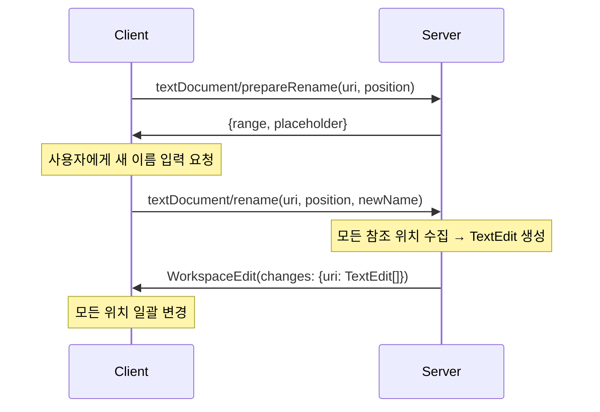

# Rename Symbol 구현하기

이 문서는 LSP 서버에서 **Rename Symbol** 기능을 구현하는 방법을 설명합니다. 변수나 함수 이름을 변경하면 해당 심볼의 정의와 모든 사용처가 동시에 업데이트됩니다. 이 기능은 리팩토링의 핵심으로, 안전하게 코드베이스 전체의 식별자 이름을 변경할 수 있게 해줍니다.

## 목차

1. [Rename Symbol이란](#rename-symbol이란)
2. [LSP 프로토콜](#lsp-프로토콜)
3. [WorkspaceEdit 이해하기](#workspaceedit-이해하기)
4. [prepareRename 구현](#preparerename-구현)
5. [레퍼런스 수집과 이름 변경](#레퍼런스-수집과-이름-변경)
6. [바인딩 사이트 이름 스팬 계산](#바인딩-사이트-이름-스팬-계산)
7. [handleRename 구현](#handlerename-구현)
8. [Protocol.fs 헬퍼 함수](#protocolfs-헬퍼-함수)
9. [Server.fs 통합](#serverfs-통합)
10. [테스트 작성](#테스트-작성)
11. [주의사항과 엣지 케이스](#주의사항과-엣지-케이스)

---

## Rename Symbol이란

**Rename Symbol**은 변수, 함수, 파라미터의 이름을 변경할 때 해당 심볼의 **정의와 모든 사용처**를 동시에 업데이트하는 기능입니다.

### VS Code에서의 사용

```
test.fun
────────
1 | let add = fun x -> fun y -> x + y in
2 | let result = add 1 2 in
3 | result
    ^^^^^^
    [F2] 또는 우클릭 → "Rename Symbol"
    → 새 이름 입력: "finalValue"
    → 모든 "result" 사용처가 "finalValue"로 변경됨
```

**트리거 방법:**
- `F2` 키
- 우클릭 → "Rename Symbol"
- 명령 팔레트 → "Rename Symbol"

### 핵심 동작

1. 사용자가 커서를 변수 위에 놓고 F2 입력
2. 클라이언트가 `textDocument/prepareRename` 요청 (옵셔널)
3. 서버가 rename 가능 여부 확인, 범위와 현재 이름 반환
4. 사용자가 새 이름 입력
5. 클라이언트가 `textDocument/rename` 요청 전송
6. 서버가 `WorkspaceEdit` 반환 (모든 변경사항)
7. 클라이언트가 파일 업데이트 적용



---

## LSP 프로토콜

Rename은 **두 단계**로 구성됩니다:

### 1. textDocument/prepareRename (옵셔널)

Rename 전에 검증 단계입니다. 이 요청으로 다음을 확인합니다:
- 커서 위치가 rename 가능한 심볼인가?
- Rename할 범위와 현재 이름은?

```typescript
interface TextDocumentPositionParams {
    textDocument: TextDocumentIdentifier  // { uri: "file:///test.fun" }
    position: Position                     // { line: 1, character: 13 }
}
```

**요청 예시:**
```json
{
    "jsonrpc": "2.0",
    "id": 7,
    "method": "textDocument/prepareRename",
    "params": {
        "textDocument": { "uri": "file:///test.fun" },
        "position": { "line": 1, "character": 13 }
    }
}
```

**응답 형식:**

PrepareRenameResult는 세 가지 형태를 지원합니다:

| 형식 | 사용 시기 | 구조 |
|------|----------|------|
| `Range` | 간단한 범위만 반환 | `{ start, end }` |
| `RangeWithPlaceholder` | 범위 + 현재 이름 | `{ range, placeholder }` |
| `DefaultBehavior` | 범위 + 이름 + 가이드 | `{ defaultBehavior: true }` |

FunLang은 **RangeWithPlaceholder**를 사용합니다 (가장 일반적).

**응답 예시:**
```json
{
    "jsonrpc": "2.0",
    "id": 7,
    "result": {
        "range": {
            "start": { "line": 1, "character": 4 },
            "end": { "line": 1, "character": 10 }
        },
        "placeholder": "result"
    }
}
```

**에러 응답 (rename 불가):**
```json
{
    "jsonrpc": "2.0",
    "id": 7,
    "error": {
        "code": -32600,
        "message": "Cannot rename this symbol"
    }
}
```

### 2. textDocument/rename (필수)

실제 rename 작업을 수행합니다.

```typescript
interface RenameParams {
    textDocument: TextDocumentIdentifier
    position: Position
    newName: string  // 사용자가 입력한 새 이름
}
```

**요청 예시:**
```json
{
    "jsonrpc": "2.0",
    "id": 8,
    "method": "textDocument/rename",
    "params": {
        "textDocument": { "uri": "file:///test.fun" },
        "position": { "line": 1, "character": 13 },
        "newName": "finalValue"
    }
}
```

**응답: WorkspaceEdit**

```typescript
interface WorkspaceEdit {
    changes?: { [uri: string]: TextEdit[] }  // 파일별 편집 목록
    documentChanges?: (TextDocumentEdit | CreateFile | RenameFile | DeleteFile)[]
    changeAnnotations?: { [id: string]: ChangeAnnotation }
}

interface TextEdit {
    range: Range      // 교체할 범위
    newText: string   // 새 텍스트
}
```

**응답 예시:**
```json
{
    "jsonrpc": "2.0",
    "id": 8,
    "result": {
        "changes": {
            "file:///test.fun": [
                {
                    "range": {
                        "start": { "line": 1, "character": 4 },
                        "end": { "line": 1, "character": 10 }
                    },
                    "newText": "finalValue"
                },
                {
                    "range": {
                        "start": { "line": 2, "character": 0 },
                        "end": { "line": 2, "character": 6 }
                    },
                    "newText": "finalValue"
                }
            ]
        }
    }
}
```

---

## WorkspaceEdit 이해하기

`WorkspaceEdit`는 하나 이상의 파일에 적용할 **편집 작업들의 집합**입니다.

### 구조

```fsharp
type WorkspaceEdit = {
    Changes: Map<string, TextEdit[]> option       // 간단한 형태: URI → 편집 배열
    DocumentChanges: DocumentChange[] option       // 고급 형태: 순서 보장, 파일 생성/삭제 포함
    ChangeAnnotations: Map<string, ChangeAnnotation> option  // 변경 설명 메타데이터
}
```

**FunLang은 `Changes`만 사용합니다:**
- 싱글 파일 언어 (모듈 시스템 없음)
- 텍스트 편집만 필요 (파일 생성/삭제 불필요)
- 간단하고 충분함

### TextEdit 구조

각 TextEdit는 **범위 + 새 텍스트**입니다:

```fsharp
type TextEdit = {
    Range: Range      // 교체할 소스 위치
    NewText: string   // 새 텍스트 (rename의 경우 새 이름)
}
```

### 예시: 3개 위치 rename

```funlang
let x = 1 in x + x
```

`x`를 `y`로 rename하면:

```fsharp
let edits = [|
    { Range = (0:4)-(0:5); NewText = "y" }  // 정의
    { Range = (0:13)-(0:14); NewText = "y" }  // 첫 번째 사용
    { Range = (0:17)-(0:18); NewText = "y" }  // 두 번째 사용
|]

let workspaceEdit = {
    Changes = Some (Map.ofList [ ("file:///test.fun", edits) ])
    DocumentChanges = None
    ChangeAnnotations = None
}
```

VS Code는 이 `WorkspaceEdit`를 받아서:
1. 각 `TextEdit`의 `Range` 위치의 텍스트를 찾음
2. 해당 범위를 `NewText`로 교체
3. 파일 저장 또는 변경사항 표시

---

## prepareRename 구현

`prepareRename`은 rename 가능 여부를 검증하고, 정확한 범위를 반환합니다.

### 왜 필요한가?

1. **조기 실패**: 사용자가 이름을 입력하기 전에 불가능한 경우 알림
2. **정확한 범위**: 전체 표현식 span이 아닌 **이름만**의 정확한 위치
3. **현재 이름 제공**: VS Code가 입력창에 미리 채워줌

### Rename 가능한 심볼

FunLang에서 rename 가능한 것:
- `Var` - 변수 참조
- `Let` - let 바인딩
- `LetRec` - 재귀 함수 바인딩
- `Lambda` - 람다 파라미터
- `LambdaAnnot` - 타입 주석 람다 파라미터

Rename **불가능**한 것:
- 숫자, 문자열, 불리언 리터럴
- 키워드 (`let`, `in`, `if` 등)
- 연산자 (`+`, `-`, `*` 등)

### findNameInSource 헬퍼 함수

Let/LetRec/Lambda의 span은 **전체 표현식**을 커버합니다:

```funlang
let result = 42 in result
^^^^^^^^^^^^^^
전체 Let 표현식 span (0:0)-(0:15)

    ^^^^^^
    이름만의 span이 필요: (0:4)-(0:10)
```

`findNameInSource`는 소스 텍스트에서 정확한 이름 위치를 찾습니다:

```fsharp
// Rename.fs
/// Find the exact character range of an identifier name within source text
/// Given a definition span (which may cover whole expression), find just the name
/// Searches first ~15 chars after startCol for the identifier
let findNameInSource (text: string) (name: string) (startLine: int) (startCol: int) : Span option =
    let lines = text.Split('\n')
    if startLine < lines.Length then
        let line = lines.[startLine]
        let searchEnd = min (startCol + 15) line.Length
        let searchArea = line.Substring(startCol, searchEnd - startCol)
        let idx = searchArea.IndexOf(name)
        if idx >= 0 then
            let nameStart = startCol + idx
            Some {
                FileName = ""
                StartLine = startLine
                StartColumn = nameStart
                EndLine = startLine
                EndColumn = nameStart + name.Length - 1
            }
        else None
    else None
```

**동작:**
1. 해당 라인 추출
2. startCol부터 ~15자 범위 검색 (키워드 `let `, `fun ` 등 건너뛰기)
3. 이름 문자열 위치 찾기
4. 정확한 span 반환

**예시:**
```funlang
let result = 42
```
- 입력: `name="result"`, `startLine=0`, `startCol=0`
- `searchArea = "let result = 42"` (최대 15자)
- `idx = searchArea.IndexOf("result") = 4`
- `nameStart = 0 + 4 = 4`
- 반환: `Span(0, 4, 0, 10)` - "result"의 정확한 위치

### handlePrepareRename 구현

```fsharp
// Rename.fs
open Ionide.LanguageServerProtocol.Types
open LangLSP.Server.AstLookup
open LangLSP.Server.DocumentSync
open LangLSP.Server.Protocol
open Ast

/// Handle textDocument/prepareRename request
/// Validates that cursor is on a renameable symbol and returns range + placeholder
let handlePrepareRename (p: TextDocumentPositionParams) : Async<PrepareRenameResult option> =
    async {
        match getDocument p.TextDocument.Uri with
        | None -> return None
        | Some text ->
            try
                let lexbuf = FSharp.Text.Lexing.LexBuffer<char>.FromString(text)
                let ast = Parser.start Lexer.tokenize lexbuf

                match findNodeAtPosition p.Position ast with
                | None -> return None
                | Some node ->
                    let result =
                        match node with
                        | Var(name, span) ->
                            // Variable reference - renameable
                            Some (U3.C2 { Range = spanToLspRange span; Placeholder = name })

                        | Let(name, _, _, span) ->
                            // Let binding - find tight range for name
                            match findNameInSource text name span.StartLine span.StartColumn with
                            | Some nameSpan ->
                                Some (U3.C2 { Range = spanToLspRange nameSpan; Placeholder = name })
                            | None ->
                                // Fallback to start position
                                let fallbackRange = {
                                    Start = { Line = uint32 span.StartLine; Character = uint32 span.StartColumn }
                                    End = { Line = uint32 span.StartLine; Character = uint32 (span.StartColumn + name.Length) }
                                }
                                Some (U3.C2 { Range = fallbackRange; Placeholder = name })

                        | LetRec(name, _, _, _, span) ->
                            // Recursive function - find tight range
                            match findNameInSource text name span.StartLine span.StartColumn with
                            | Some nameSpan ->
                                Some (U3.C2 { Range = spanToLspRange nameSpan; Placeholder = name })
                            | None ->
                                let fallbackRange = {
                                    Start = { Line = uint32 span.StartLine; Character = uint32 span.StartColumn }
                                    End = { Line = uint32 span.StartLine; Character = uint32 (span.StartColumn + name.Length) }
                                }
                                Some (U3.C2 { Range = fallbackRange; Placeholder = name })

                        | Lambda(param, _, span) ->
                            // Lambda parameter - find tight range
                            match findNameInSource text param span.StartLine span.StartColumn with
                            | Some nameSpan ->
                                Some (U3.C2 { Range = spanToLspRange nameSpan; Placeholder = param })
                            | None ->
                                let fallbackRange = {
                                    Start = { Line = uint32 span.StartLine; Character = uint32 span.StartColumn }
                                    End = { Line = uint32 span.StartLine; Character = uint32 (span.StartColumn + param.Length) }
                                }
                                Some (U3.C2 { Range = fallbackRange; Placeholder = param })

                        | LambdaAnnot(param, _, _, span) ->
                            // Annotated lambda parameter - find tight range
                            match findNameInSource text param span.StartLine span.StartColumn with
                            | Some nameSpan ->
                                Some (U3.C2 { Range = spanToLspRange nameSpan; Placeholder = param })
                            | None ->
                                let fallbackRange = {
                                    Start = { Line = uint32 span.StartLine; Character = uint32 span.StartColumn }
                                    End = { Line = uint32 span.StartLine; Character = uint32 (span.StartColumn + param.Length) }
                                }
                                Some (U3.C2 { Range = fallbackRange; Placeholder = param })

                        | _ ->
                            // Not a renameable symbol (numbers, keywords, operators)
                            None

                    return result

            with _ ->
                return None
    }
```

**동작 흐름:**

```
TextDocumentPositionParams 수신
    ↓
문서 텍스트 조회
    ↓
AST 파싱
    ↓
findNodeAtPosition으로 노드 찾기
    ↓
    ├─ Var → span 그대로 사용 (이미 정확함)
    ├─ Let/LetRec/Lambda → findNameInSource로 이름만 span 추출
    └─ 기타 → None (rename 불가)
    ↓
RangeWithPlaceholder 반환 (U3.C2)
```

**핵심 포인트:**
1. `Var` 노드는 이미 정확한 범위를 가짐 → 그대로 사용
2. `Let`/`LetRec`/`Lambda`는 전체 표현식 span → `findNameInSource`로 이름만 추출
3. 모든 경우 fallback 제공 (findNameInSource 실패 시)
4. `U3.C2`는 Ionide의 union type (RangeWithPlaceholder)

---

## 레퍼런스 수집과 이름 변경

Rename은 **정의 + 모든 레퍼런스**를 동시에 변경해야 합니다.

### collectReferencesForBinding (섀도잉 인식)

단순히 이름이 같은 모든 `Var` 노드를 찾으면 안 됩니다:

```funlang
let x = 1 in
  let x = 2 in
    x + 1
```

마지막 `x`는 **내부 `let x = 2`**를 참조합니다. 외부 `x`를 rename하면 내부 `x`는 변경되면 안 됩니다.

`collectReferencesForBinding`은 **특정 정의에 속하는** 레퍼런스만 수집합니다:

```fsharp
// References.fs (이전 튜토리얼에서 구현)
/// Collect references to a SPECIFIC binding (shadowing-aware)
/// Only returns Var nodes that resolve to the definition at defSpan
let collectReferencesForBinding (varName: string) (defSpan: Span) (ast: Expr) : Span list =
    // Find all Var nodes with matching name
    let allRefs = collectReferences varName ast

    // Filter to only those that resolve to our specific definition
    allRefs
    |> List.filter (fun refSpan ->
        // Create Position from the reference span
        let pos : Position = {
            Line = uint32 refSpan.StartLine
            Character = uint32 refSpan.StartColumn
        }
        // Check if this reference resolves to our target definition
        match findDefinitionForVar varName ast pos with
        | Some foundDefSpan ->
            foundDefSpan.StartLine = defSpan.StartLine &&
            foundDefSpan.StartColumn = defSpan.StartColumn
        | None -> false
    )
```

**알고리즘:**
1. `collectReferences`로 이름이 같은 모든 `Var` 노드 찾기
2. 각 `Var`에 대해 `findDefinitionForVar` 호출
3. 반환된 정의 span이 우리의 타겟 `defSpan`과 일치하는 것만 필터링
4. 섀도잉으로 인한 다른 정의의 레퍼런스는 제외됨

### 예시

```funlang
let x = 1 in        (* defSpan1: (0, 4) *)
  let x = 2 in      (* defSpan2: (1, 6) *)
    x + x           (* 두 x 모두 defSpan2 참조 *)
```

`defSpan1`에서 rename 요청 시:
1. `collectReferences "x"` → 4개 Var 노드 (정의 2개는 제외, 사용 2개만)
2. 사용처 2개에 대해 `findDefinitionForVar`:
   - (2, 4)의 x → defSpan2 반환 → 필터링됨
   - (2, 8)의 x → defSpan2 반환 → 필터링됨
3. 결과: 빈 배열 (외부 x는 사용되지 않음)

---

## 바인딩 사이트 이름 스팬 계산

레퍼런스는 `Var` 노드이므로 정확한 span을 가지지만, **정의 사이트**는 전체 표현식 span을 가집니다.

Rename의 TextEdit는 **이름만** 교체해야 하므로, 정의 사이트에도 `findNameInSource`를 사용합니다:

```fsharp
// For definition site, get tight name-only span from source
let defNameSpan =
    match findNameInSource text varName defSpan.StartLine defSpan.StartColumn with
    | Some nameSpan -> nameSpan
    | None ->
        // Fallback: create span from definition position
        {
            FileName = ""
            StartLine = defSpan.StartLine
            StartColumn = defSpan.StartColumn
            EndLine = defSpan.StartLine
            EndColumn = defSpan.StartColumn + varName.Length - 1
        }
```

**예시:**

```funlang
let result = 42 in result
```

- `defSpan = (0, 0)-(0, 15)` (전체 Let 표현식)
- `findNameInSource text "result" 0 0` → `(0, 4)-(0, 10)`
- `defNameSpan = (0, 4)-(0, 10)` ← 이것만 TextEdit에 포함

---

## handleRename 구현

실제 rename 로직입니다.

```fsharp
// Rename.fs
/// Handle textDocument/rename request
/// Collects all references + definition and returns WorkspaceEdit
let handleRename (p: RenameParams) : Async<WorkspaceEdit option> =
    async {
        match getDocument p.TextDocument.Uri with
        | None -> return None
        | Some text ->
            try
                let lexbuf = FSharp.Text.Lexing.LexBuffer<char>.FromString(text)
                let ast = Parser.start Lexer.tokenize lexbuf

                match findNodeAtPosition p.Position ast with
                | None -> return None
                | Some node ->
                    // Determine variable name and definition span
                    let varNameOpt, defSpanOpt =
                        match node with
                        | Var(name, _) ->
                            // Variable reference - find its definition
                            let def = findDefinitionForVar name ast p.Position
                            (Some name, def)

                        | Let(name, _, _, span) ->
                            // Let binding site
                            (Some name, Some span)

                        | LetRec(name, _, _, _, span) ->
                            // Recursive function binding
                            (Some name, Some span)

                        | Lambda(param, _, span) ->
                            // Lambda parameter
                            (Some param, Some span)

                        | LambdaAnnot(param, _, _, span) ->
                            // Annotated lambda parameter
                            (Some param, Some span)

                        | _ ->
                            // Not a renameable symbol
                            (None, None)

                    match varNameOpt, defSpanOpt with
                    | Some varName, Some defSpan ->
                        // Collect all scoped references
                        let references = collectReferencesForBinding varName defSpan ast

                        // For definition site, get tight name-only span from source
                        let defNameSpan =
                            match findNameInSource text varName defSpan.StartLine defSpan.StartColumn with
                            | Some nameSpan -> nameSpan
                            | None ->
                                // Fallback: create span from definition position
                                {
                                    FileName = ""
                                    StartLine = defSpan.StartLine
                                    StartColumn = defSpan.StartColumn
                                    EndLine = defSpan.StartLine
                                    EndColumn = defSpan.StartColumn + varName.Length - 1
                                }

                        // Combine definition name span + references
                        let allSpans = defNameSpan :: references

                        // Remove duplicates (may have overlapping spans)
                        let distinctSpans =
                            allSpans
                            |> List.distinctBy (fun span ->
                                (span.StartLine, span.StartColumn, span.EndLine, span.EndColumn))

                        // Create TextEdit for each span
                        let edits =
                            distinctSpans
                            |> List.map (fun span -> createTextEdit span p.NewName)
                            |> Array.ofList

                        // Create WorkspaceEdit
                        let workspaceEdit = createWorkspaceEdit p.TextDocument.Uri edits

                        return Some workspaceEdit

                    | _ ->
                        return None

            with _ ->
                return None
    }
```

**동작 흐름:**

```
RenameParams 수신 (position + newName)
    ↓
문서 텍스트 조회 + AST 파싱
    ↓
findNodeAtPosition으로 커서 위치 노드 찾기
    ↓
노드 타입별 처리:
    ├─ Var → findDefinitionForVar로 정의 찾기
    ├─ Let/LetRec/Lambda → span이 곧 정의
    └─ 기타 → None
    ↓
collectReferencesForBinding으로 섀도잉 인식 레퍼런스 수집
    ↓
findNameInSource로 정의 사이트 이름만 span 추출
    ↓
정의 + 레퍼런스 span 결합
    ↓
distinctBy로 중복 제거
    ↓
각 span → TextEdit (range + newName)
    ↓
WorkspaceEdit 생성 (URI → TextEdit[])
    ↓
반환
```

**핵심 포인트:**

1. **Var 노드에서 시작해도 동작**: `findDefinitionForVar`로 정의를 먼저 찾음
2. **섀도잉 처리**: `collectReferencesForBinding` 사용
3. **정확한 범위**: `findNameInSource`로 이름만 교체
4. **중복 제거**: `distinctBy`로 동일한 span 제거 (AST 구조상 발생 가능)

---

## Protocol.fs 헬퍼 함수

`createTextEdit`와 `createWorkspaceEdit`는 반복 코드를 줄이기 위한 헬퍼입니다.

### createTextEdit

Span과 새 텍스트로 TextEdit 생성:

```fsharp
// Protocol.fs
/// Create TextEdit from span and new text
let createTextEdit (span: Span) (newText: string) : TextEdit =
    {
        Range = spanToLspRange span
        NewText = newText
    }
```

**사용:**
```fsharp
let edit = createTextEdit span "newName"
// { Range = (0:4)-(0:10); NewText = "newName" }
```

### createWorkspaceEdit

단일 파일 변경을 위한 WorkspaceEdit 생성:

```fsharp
// Protocol.fs
/// Create WorkspaceEdit for single-file changes
let createWorkspaceEdit (uri: string) (edits: TextEdit[]) : WorkspaceEdit =
    {
        Changes = Some (Map.ofList [ (uri, edits) ])
        DocumentChanges = None
        ChangeAnnotations = None
    }
```

**사용:**
```fsharp
let edits = [|
    createTextEdit span1 "newName"
    createTextEdit span2 "newName"
    createTextEdit span3 "newName"
|]
let workspaceEdit = createWorkspaceEdit uri edits
```

**왜 헬퍼가 필요한가?**
- FunLang은 싱글 파일이므로 항상 동일한 구조
- Rename과 Find References 모두 사용 (코드 재사용)
- LSP 타입의 복잡한 구조를 숨김

---

## Server.fs 통합

### 서버 기능 등록

```fsharp
// Server.fs
let serverCapabilities : ServerCapabilities =
    { ServerCapabilities.Default with
        TextDocumentSync = ...
        HoverProvider = Some (U2.C1 true)
        DefinitionProvider = Some (U2.C1 true)
        ReferencesProvider = Some (U2.C1 true)
        RenameProvider = Some (U3.C3 {           // 추가!
            PrepareProvider = Some true           // prepareRename 지원
            WorkDoneProgress = None
        })
    }
```

**RenameOptions 구조:**
```fsharp
type RenameOptions = {
    PrepareProvider: bool option    // prepareRename 지원 여부
    WorkDoneProgress: bool option   // 진행 상황 보고 지원
}
```

`PrepareProvider = Some true`로 설정하면 클라이언트는 `prepareRename` 요청을 먼저 보냅니다.

### 핸들러 등록

```fsharp
// Server.fs
module Handlers =
    /// Handle textDocument/prepareRename request
    let textDocumentPrepareRename (p: TextDocumentPositionParams) : Async<PrepareRenameResult option> =
        handlePrepareRename p

    /// Handle textDocument/rename request
    let textDocumentRename (p: RenameParams) : Async<WorkspaceEdit option> =
        handleRename p
```

### 전체 연결

1. **초기화 시:**
   - 클라이언트 → `initialize` 요청
   - 서버 → `RenameProvider = { PrepareProvider = true }` 응답
   - 클라이언트는 Rename 기능 활성화

2. **사용자가 F2를 누르면:**
   - 클라이언트 → `textDocument/prepareRename` 요청
   - 서버 → 범위 + 현재 이름 반환 (또는 에러)
   - 클라이언트 → 입력창 표시, 현재 이름 미리 채움

3. **사용자가 새 이름 입력 후 Enter:**
   - 클라이언트 → `textDocument/rename` 요청 (newName 포함)
   - 서버 → `WorkspaceEdit` 반환
   - 클라이언트 → 모든 TextEdit 적용

---

## 테스트 작성

### 기본 테스트 구조

```fsharp
// RenameTests.fs
module LangLSP.Tests.RenameTests

open Expecto
open Ionide.LanguageServerProtocol.Types
open LangLSP.Server.Rename
open LangLSP.Server.DocumentSync

/// Create RenameParams for testing
let makeRenameParams uri line char newName : RenameParams =
    {
        TextDocument = { Uri = uri }
        Position = { Line = uint32 line; Character = uint32 char }
        NewName = newName
        WorkDoneToken = None
    }

/// Create TextDocumentPositionParams for prepareRename
let makePrepareRenameParams uri line char : TextDocumentPositionParams =
    {
        TextDocument = { Uri = uri }
        Position = { Line = uint32 line; Character = uint32 char }
    }
```

### 헬퍼 함수들

```fsharp
/// Helper: setup document and perform rename
let setupAndRename uri text line char newName =
    clearAll()
    handleDidOpen (makeDidOpenParams uri text)
    handleRename (makeRenameParams uri line char newName) |> Async.RunSynchronously

/// Helper: setup document and prepare rename
let setupAndPrepareRename uri text line char =
    clearAll()
    handleDidOpen (makeDidOpenParams uri text)
    handlePrepareRename (makePrepareRenameParams uri line char) |> Async.RunSynchronously

/// Extract edits count from WorkspaceEdit
let countEdits (workspaceEdit: WorkspaceEdit option) : int =
    match workspaceEdit with
    | Some edit ->
        match edit.Changes with
        | Some changes ->
            changes.Values
            |> Seq.map Array.length
            |> Seq.sum
        | None -> 0
    | None -> 0
```

**왜 `countEdits`가 유요한가?**
- WorkspaceEdit 구조가 복잡함 (중첩된 option)
- 테스트에서는 "몇 개 변경되었나?"만 확인하면 충분
- 정확한 Range까지 검증하면 테스트가 brittle해짐

### 테스트 케이스들

```fsharp
[<Tests>]
let renameTests =
    testSequenced <| testList "Rename" [
        testList "Variable rename (RENAME-01)" [
            test "renames all variable occurrences" {
                // "let x = 1 in x + x"
                //      ^ position (0, 4) - at definition
                let result = setupAndRename "file:///test.fun" "let x = 1 in x + x" 0 4 "newX"
                Expect.isSome result "Should return WorkspaceEdit"
                // Should rename definition + 2 usages = 3 edits
                let editCount = countEdits result
                Expect.equal editCount 3 "Should have 3 edits (def + 2 usages)"
            }

            test "renames from usage position" {
                // "let x = 1 in x + x"
                //              ^ position (0, 13) - at usage
                let result = setupAndRename "file:///test.fun" "let x = 1 in x + x" 0 13 "y"
                Expect.isSome result "Should return WorkspaceEdit"
                let editCount = countEdits result
                Expect.equal editCount 3 "Should rename all occurrences from usage position"
            }
        ]

        testList "Function rename (RENAME-02)" [
            test "renames function and all calls" {
                // "let f = fun x -> x in f 1"
                //      ^ position (0, 4) - function definition
                let result = setupAndRename "file:///test.fun" "let f = fun x -> x in f 1" 0 4 "g"
                Expect.isSome result "Should return WorkspaceEdit"
                let editCount = countEdits result
                Expect.isGreaterThanOrEqual editCount 2 "Should rename function and calls"
            }

            test "renames recursive function" {
                // "let rec fact n = if n = 0 then 1 else n * fact (n - 1) in fact 5"
                //         ^ position around (0, 8) - function name
                let code = "let rec fact n = if n = 0 then 1 else n * fact (n - 1) in fact 5"
                let result = setupAndRename "file:///test.fun" code 0 8 "factorial"
                Expect.isSome result "Should return WorkspaceEdit"
                let editCount = countEdits result
                Expect.isGreaterThanOrEqual editCount 2 "Should rename all function occurrences"
            }
        ]

        testList "Prepare rename (RENAME-03)" [
            test "validates rename on variable" {
                let result = setupAndPrepareRename "file:///test.fun" "let x = 42 in x" 0 4
                Expect.isSome result "Should allow rename on variable"
                match result with
                | Some (U3.C2 rangeWithPlaceholder) ->
                    Expect.equal rangeWithPlaceholder.Placeholder "x" "Placeholder should be variable name"
                | _ -> failtest "Expected RangeWithPlaceholder"
            }

            test "rejects rename on number literal" {
                let result = setupAndPrepareRename "file:///test.fun" "42" 0 0
                Expect.isNone result "Should reject rename on number literal"
            }

            test "validates rename on lambda parameter" {
                let result = setupAndPrepareRename "file:///test.fun" "fun x -> x" 0 4
                Expect.isSome result "Should allow rename on lambda parameter"
            }
        ]

        testList "Edge cases" [
            test "handles shadowing correctly" {
                // "let x = 1 in let x = 2 in x"
                //                   ^ position (0, 17) - inner x definition
                let result = setupAndRename "file:///test.fun" "let x = 1 in let x = 2 in x" 0 17 "y"
                Expect.isSome result "Should handle shadowed variable"
                // Should only rename inner x occurrences
                let editCount = countEdits result
                Expect.equal editCount 2 "Should rename inner x (def + usage)"
            }

            test "returns None for parse error" {
                let text = "let x ="  // Incomplete/invalid
                let result = setupAndRename "file:///test.fun" text 0 0 "newName"
                Expect.isNone result "Parse error should return None"
            }
        ]
    ]
```

### 테스트 실행

```bash
dotnet run --project src/LangLSP.Tests

# 출력:
# [Rename] Variable rename - renames all variable occurrences - Passed
# [Rename] Variable rename - renames from usage position - Passed
# [Rename] Function rename - renames function and all calls - Passed
# [Rename] Prepare rename - validates rename on variable - Passed
# [Rename] Edge cases - handles shadowing correctly - Passed
```

---

## 주의사항과 엣지 케이스

### 1. 섀도잉 처리 필수

**잘못된 구현:**
```fsharp
// 이름만 보고 모든 Var 수집
let allRefs = collectReferences varName ast
let allSpans = defNameSpan :: allRefs  // 잘못됨!
```

```funlang
let x = 1 in
  let x = 2 in
    x
```
외부 `x`를 rename하면 내부 `x`까지 변경됨 → **버그!**

**올바른 구현:**
```fsharp
// 특정 정의에 속하는 레퍼런스만
let references = collectReferencesForBinding varName defSpan ast
```

### 2. 정의 사이트 이름만 교체

**잘못된 구현:**
```fsharp
// 전체 Let 표현식 span 사용
let allSpans = defSpan :: references  // 잘못됨!
```

```funlang
let result = 42 in result
^^^^^^^^^^^^^^
전체 span을 교체하면 "= 42 in result"까지 삭제됨!
```

**올바른 구현:**
```fsharp
// findNameInSource로 이름만 추출
let defNameSpan = findNameInSource text varName defSpan.StartLine defSpan.StartColumn
```

### 3. 중복 제거

`Let(name, ...)`와 `Var(name, ...)`가 AST에 동시에 존재할 수 있습니다.

**예시:**
```funlang
let rec f n = f (n - 1)
```
- `LetRec("f", ...)` 노드
- 본문에 `Var("f", ...)` 노드 (재귀 호출)

둘 다 수집하면 중복 가능 → `distinctBy`로 제거:

```fsharp
let distinctSpans =
    allSpans
    |> List.distinctBy (fun span ->
        (span.StartLine, span.StartColumn, span.EndLine, span.EndColumn))
```

### 4. prepareRename 실패 처리

**시나리오:**
- 사용자가 키워드 위에서 F2 입력
- 또는 숫자 리터럴 위에서 rename 시도

**올바른 응답:**
```fsharp
| _ ->
    // Not a renameable symbol
    return None
```

VS Code는 `None`을 받으면 "Cannot rename this symbol" 메시지 표시

### 5. Var 노드에서 시작 시 정의 찾기

**시나리오:**
```funlang
let x = 1 in x
             ^
             여기서 F2
```

Var 노드는 **사용처**이지 정의가 아닙니다. 먼저 정의를 찾아야 합니다:

```fsharp
| Var(name, _) ->
    // Variable reference - find its definition
    let def = findDefinitionForVar name ast p.Position
    (Some name, def)
```

이렇게 해야 정의 + 모든 사용처를 함께 rename할 수 있습니다.

### 6. 파싱 에러 처리

**시나리오:**
```funlang
let x =
```
불완전한 코드에서 rename 시도

**올바른 처리:**
```fsharp
try
    let ast = Parser.start Lexer.tokenize lexbuf
    ...
with _ ->
    return None
```

VS Code는 `None`을 받으면 조용히 실패 (에러 메시지 없이)

---

## 정리

Rename Symbol 구현의 핵심:

1. **prepareRename** - 조기 검증
   - Rename 가능 여부 확인
   - 정확한 범위 반환 (findNameInSource)
   - 현재 이름 제공 (placeholder)

2. **섀도잉 인식 레퍼런스 수집**
   - `collectReferencesForBinding` 사용
   - 각 Var가 어떤 정의를 참조하는지 확인
   - 타겟 정의와 일치하는 것만 수집

3. **정의 사이트 이름 추출**
   - Let/LetRec/Lambda span은 전체 표현식
   - `findNameInSource`로 이름만 span 추출
   - Fallback으로 startCol + name.Length 사용

4. **WorkspaceEdit 생성**
   - 정의 + 레퍼런스 span 결합
   - 중복 제거 (`distinctBy`)
   - 각 span → TextEdit
   - 단일 파일 WorkspaceEdit 반환

5. **엣지 케이스 처리**
   - Var에서 시작 → 정의 먼저 찾기
   - 섀도잉 정확히 처리
   - 파싱 에러 → None 반환
   - Rename 불가능한 노드 → None 반환

---

## 다음 단계

Rename Symbol을 완성했습니다! 이제 사용자는 안전하게 식별자 이름을 변경할 수 있습니다.

다음 Phase에서 구현할 기능들:
- **Code Actions**: 자동 수정 제안 (미사용 변수 제거, 타입 주석 추가 등)
- **Folding Ranges**: 코드 접기
- **Document Symbols**: 아웃라인 뷰

---

## 참고 자료

- [LSP Specification - textDocument/rename](https://microsoft.github.io/language-server-protocol/specifications/lsp/3.17/specification/#textDocument_rename)
- [LSP Specification - textDocument/prepareRename](https://microsoft.github.io/language-server-protocol/specifications/lsp/3.17/specification/#textDocument_prepareRename)
- [Rename Symbol in LSP - Language Server Tutorial](https://langserver.org/renaming/)
- [WorkspaceEdit - LSP](https://microsoft.github.io/language-server-protocol/specifications/lsp/3.17/specification/#workspaceEdit)

---

**-> 다음: Phase 4 - Code Actions 구현**
