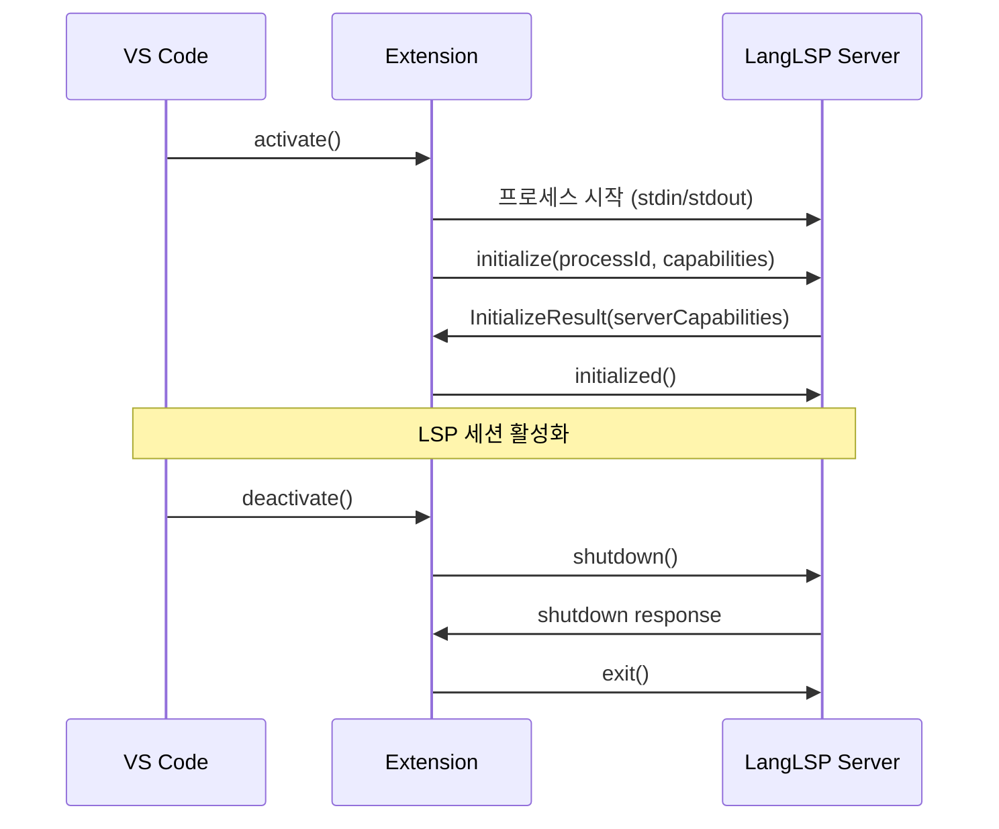

# VS Code Extension 패키징

지금까지 우리는 완전한 Language Server를 만들어왔다. 진단(Diagnostics), 호버(Hover), 자동 완성(Completion), 정의로 이동(Go to Definition), 참조 찾기(Find References), 이름 바꾸기(Rename), 그리고 코드 액션(Code Actions)까지 모두 구현했다.

이제 마지막 단계이다. 이 강력한 Language Server를 누구나 설치할 수 있는 VS Code Extension으로 패키징하는 방법을 배운다. 이 튜토리얼에서는 TextMate 문법을 사용한 구문 강조(Syntax Highlighting), 언어 설정(Language Configuration), 코드 스니펫(Code Snippets), 그리고 VSIX 패키징을 다룬다.

## 목차

1. [VS Code Extension 구조](#vs-code-extension-구조)
2. [TextMate Grammar](#textmate-grammar)
3. [Language Configuration](#language-configuration)
4. [코드 스니펫](#코드-스니펫)
5. [package.json Contributes 설정](#packagejson-contributes-설정)
6. [Extension 진입점 (extension.ts)](#extension-진입점-extensionts)
7. [VSIX 패키징](#vsix-패키징)
8. [로컬 설치 및 테스트](#로컬-설치-및-테스트)
9. [정리](#정리)

---

## VS Code Extension 구조

VS Code Extension은 크게 두 가지 방식으로 기능을 제공한다:

1. **선언적(Declarative)**: JSON 파일로 정의 (문법, 스니펫, 언어 설정)
2. **명령적(Imperative)**: TypeScript 코드로 구현 (LSP 클라이언트 시작)

### Extension의 구조

우리 FunLang Extension의 디렉토리 구조이다:

```
client/
├── package.json                    # 확장 매니페스트 (메타데이터 + contributes)
├── language-configuration.json     # 언어 설정 (주석, 괄호 매칭 등)
├── src/extension.ts                # LSP 클라이언트 진입점 (TypeScript)
├── out/extension.js                # 컴파일된 JavaScript
├── syntaxes/                       # 문법 정의 (TextMate)
│   └── funlang.tmLanguage.json
├── snippets/                       # 코드 스니펫
│   └── funlang.json
├── images/                         # 확장 아이콘
│   └── funlang-icon.png
└── server/                         # 패키징 시 LSP 서버 바이너리
    └── LangLSP.Server
```

### Extension 로딩 과정

VS Code가 Extension을 로드하는 과정이다:

1. **`package.json` 읽기**: `engines.vscode` 버전 체크, `contributes` 등록
2. **선언적 기능 활성화**: 문법, 스니펫, 언어 설정 즉시 적용
3. **Activation Event 대기**: `activationEvents`에 정의된 이벤트 발생 시
4. **`main` 진입점 실행**: `extension.ts`의 `activate()` 함수 호출
5. **명령적 기능 시작**: LSP 클라이언트 시작, 서버 프로세스 생성



VS Code 1.74+에서는 `activationEvents`를 빈 배열(`[]`)로 두면, `contributes.languages`에 등록된 언어의 파일을 열 때 자동으로 활성화된다.

### package.json의 핵심 필드

```json
{
  "name": "funlang",              // Extension ID (소문자, 하이픈)
  "displayName": "FunLang",       // 사용자에게 표시되는 이름
  "publisher": "funlang",         // 게시자 ID (마켓플레이스 필요)
  "version": "0.1.0",             // 시맨틱 버전
  "engines": {
    "vscode": "^1.74.0"           // 최소 VS Code 버전
  },
  "activationEvents": [],         // 빈 배열 = 자동 활성화
  "main": "./out/extension.js",   // 진입점 (컴파일된 JS)
  "contributes": { /* ... */ }    // 선언적 기여 사항
}
```

**`contributes` 필드**가 가장 중요하다. 여기에 언어, 문법, 스니펫 등을 등록한다.

---

## TextMate Grammar

**TextMate Grammar**는 정규식 기반 토큰화 시스템으로, 구문 강조(Syntax Highlighting)를 제공한다. VS Code는 TextMate 문법을 사용하여 코드를 색상으로 구분한다.

### TextMate 문법의 구조

TextMate 문법 파일(`funlang.tmLanguage.json`)은 다음 구조를 가진다:

```json
{
  "$schema": "https://raw.githubusercontent.com/martinring/tmlanguage/master/tmlanguage.json",
  "name": "FunLang",
  "scopeName": "source.funlang",
  "patterns": [
    { "include": "#comments" },
    { "include": "#strings" },
    { "include": "#keywords" }
  ],
  "repository": {
    "comments": { /* 주석 규칙 */ },
    "strings": { /* 문자열 규칙 */ },
    "keywords": { /* 키워드 규칙 */ }
  }
}
```

- **`scopeName`**: 이 문법의 고유 식별자 (예: `source.funlang`)
- **`patterns`**: 최상위 토큰 매칭 규칙 배열 (순서대로 시도)
- **`repository`**: 재사용 가능한 패턴 정의 (이름으로 참조)

### FunLang 토큰 카테고리

FunLang 구문을 다음 카테고리로 나눈다:

| 카테고리 | 예시 | Scope 이름 |
|---------|------|-----------|
| 주석 | `// line`, `(* block *)` | `comment.line`, `comment.block` |
| 문자열 | `"hello\n"` | `string.quoted.double` |
| 상수 | `42`, `true`, `false` | `constant.numeric`, `constant.language.boolean` |
| 키워드 | `if`, `let`, `match` | `keyword.control` |
| 타입 | `int`, `bool`, `'a` | `support.type`, `variable.parameter.type` |
| 연산자 | `->`, `::`, `+` | `keyword.operator.*` |
| 와일드카드 | `_` | `variable.language.wildcard` |

### 주석 패턴

FunLang은 두 가지 주석을 지원한다:

```json
"comments": {
  "patterns": [
    {
      "name": "comment.line.double-slash.funlang",
      "match": "//.*$"
    },
    {
      "name": "comment.block.funlang",
      "begin": "\\(\\*",
      "end": "\\*\\)",
      "patterns": [
        { "include": "#block-comment-nested" }
      ]
    }
  ]
}
```

**중첩 블록 주석 처리**:

FunLang은 `(* (* nested *) *)`와 같이 중첩된 블록 주석을 지원한다. 이를 위해 자기 참조 패턴을 사용한다:

```json
"block-comment-nested": {
  "name": "comment.block.nested.funlang",
  "begin": "\\(\\*",
  "end": "\\*\\)",
  "patterns": [
    { "include": "#block-comment-nested" }  // 자기 자신 참조
  ]
}
```

**주의**: `(*`와 `*)`는 정규식 메타 문자이므로 `\\(\\*`, `\\*\\)`로 이스케이프해야 한다.

### 문자열 패턴

문자열은 이스케이프 시퀀스를 지원한다:

```json
"strings": {
  "name": "string.quoted.double.funlang",
  "begin": "\"",
  "end": "\"",
  "patterns": [
    {
      "name": "constant.character.escape.funlang",
      "match": "\\\\[nrt\\\\\"']"
    }
  ]
}
```

`\n`, `\r`, `\t`, `\\`, `\"`, `\'`를 이스케이프로 인식한다.

### 상수 패턴

숫자와 불린 상수를 매칭한다:

```json
"constants": {
  "patterns": [
    {
      "name": "constant.numeric.integer.funlang",
      "match": "\\b[0-9]+\\b"
    },
    {
      "name": "constant.language.boolean.funlang",
      "match": "\\b(true|false)\\b"
    }
  ]
}
```

`\b`는 **단어 경계(word boundary)**이다. `42`는 매칭하지만 `x42`는 매칭하지 않는다.

### 키워드 패턴

FunLang의 예약어이다:

```json
"keywords": {
  "name": "keyword.control.funlang",
  "match": "\\b(if|then|else|match|with|let|in|fun|rec)\\b"
}
```

**함정: 단어 경계 없이 매칭하면 문제 발생**

```json
// 잘못된 예
"match": "(let|if)"   // "letter"에서 "let" 매칭, "lift"에서 "if" 매칭

// 올바른 예
"match": "\\b(let|if)\\b"   // "let", "if"만 매칭, "letter"는 매칭 안 됨
```

### 타입 패턴

타입 키워드와 타입 변수를 구분한다:

```json
"types": {
  "patterns": [
    {
      "name": "support.type.funlang",
      "match": "\\b(int|bool|string|list)\\b"
    },
    {
      "name": "variable.parameter.type.funlang",
      "match": "'[a-zA-Z][a-zA-Z0-9_]*"
    }
  ]
}
```

- `int`, `bool`, `string`, `list`: 내장 타입 (파란색)
- `'a`, `'result`: 타입 변수 (녹색)

### 연산자 패턴

**중요: 다중 문자 연산자를 먼저 매칭해야 한다.**

```json
"operators": {
  "patterns": [
    { "name": "keyword.operator.arrow.funlang", "match": "->" },
    { "name": "keyword.operator.cons.funlang", "match": "::" },
    { "name": "keyword.operator.comparison.funlang", "match": "<>|<=|>=|<|>" },
    { "name": "keyword.operator.logical.funlang", "match": "&&|\\|\\|" },
    { "name": "keyword.operator.arithmetic.funlang", "match": "[+\\-*/]" },
    { "name": "keyword.operator.assignment.funlang", "match": "=" },
    { "name": "keyword.operator.pipe.funlang", "match": "\\|" }
  ]
}
```

**함정: 잘못된 순서로 매칭하면 분할 발생**

```
// 잘못된 순서
patterns: ["-", "->"]

코드: "x -> y"
결과: "-" 매칭, ">" 미매칭 → 색상 깨짐

// 올바른 순서
patterns: ["->", "-"]

코드: "x -> y"
결과: "->" 전체 매칭 → 정상 색상
```

TextMate는 `patterns` 배열을 순서대로 시도하므로, **긴 패턴을 먼저 배치**해야 한다.

### 와일드카드 패턴

`_`는 특별한 식별자이다:

```json
"identifiers": {
  "patterns": [
    {
      "name": "variable.language.wildcard.funlang",
      "match": "\\b_\\b"
    }
  ]
}
```

이 패턴은 `_` 단독일 때만 매칭하고, `_x`나 `x_`는 매칭하지 않는다.

### 완전한 funlang.tmLanguage.json

```json
{
  "$schema": "https://raw.githubusercontent.com/martinring/tmlanguage/master/tmlanguage.json",
  "name": "FunLang",
  "scopeName": "source.funlang",
  "patterns": [
    { "include": "#comments" },
    { "include": "#strings" },
    { "include": "#constants" },
    { "include": "#keywords" },
    { "include": "#types" },
    { "include": "#operators" },
    { "include": "#identifiers" }
  ],
  "repository": {
    "comments": {
      "patterns": [
        {
          "name": "comment.line.double-slash.funlang",
          "match": "//.*$"
        },
        {
          "name": "comment.block.funlang",
          "begin": "\\(\\*",
          "end": "\\*\\)",
          "patterns": [
            { "include": "#block-comment-nested" }
          ]
        }
      ]
    },
    "block-comment-nested": {
      "name": "comment.block.nested.funlang",
      "begin": "\\(\\*",
      "end": "\\*\\)",
      "patterns": [
        { "include": "#block-comment-nested" }
      ]
    },
    "strings": {
      "name": "string.quoted.double.funlang",
      "begin": "\"",
      "end": "\"",
      "patterns": [
        {
          "name": "constant.character.escape.funlang",
          "match": "\\\\[nrt\\\\\"']"
        }
      ]
    },
    "constants": {
      "patterns": [
        {
          "name": "constant.numeric.integer.funlang",
          "match": "\\b[0-9]+\\b"
        },
        {
          "name": "constant.language.boolean.funlang",
          "match": "\\b(true|false)\\b"
        }
      ]
    },
    "keywords": {
      "name": "keyword.control.funlang",
      "match": "\\b(if|then|else|match|with|let|in|fun|rec)\\b"
    },
    "types": {
      "patterns": [
        {
          "name": "support.type.funlang",
          "match": "\\b(int|bool|string|list)\\b"
        },
        {
          "name": "variable.parameter.type.funlang",
          "match": "'[a-zA-Z][a-zA-Z0-9_]*"
        }
      ]
    },
    "operators": {
      "patterns": [
        { "name": "keyword.operator.arrow.funlang", "match": "->" },
        { "name": "keyword.operator.cons.funlang", "match": "::" },
        { "name": "keyword.operator.comparison.funlang", "match": "<>|<=|>=|<|>" },
        { "name": "keyword.operator.logical.funlang", "match": "&&|\\|\\|" },
        { "name": "keyword.operator.arithmetic.funlang", "match": "[+\\-*/]" },
        { "name": "keyword.operator.assignment.funlang", "match": "=" },
        { "name": "keyword.operator.pipe.funlang", "match": "\\|" }
      ]
    },
    "identifiers": {
      "patterns": [
        {
          "name": "variable.language.wildcard.funlang",
          "match": "\\b_\\b"
        }
      ]
    }
  }
}
```

### TextMate 문법 테스트하기

VS Code에서 문법이 제대로 작동하는지 확인하려면:

1. `.fun` 파일 열기
2. 명령 팔레트 (Ctrl+Shift+P)
3. "Developer: Inspect Editor Tokens and Scopes" 실행
4. 커서를 토큰 위에 놓으면 Scope 이름 표시

예시:

```
Token: ->
Scopes: source.funlang keyword.operator.arrow.funlang
```

---

## Language Configuration

**Language Configuration**은 VS Code의 편집 경험을 제어하는 JSON 파일이다. 주석 토글, 괄호 매칭, 자동 닫기, 들여쓰기 규칙을 정의한다.

### language-configuration.json의 구조

```json
{
  "comments": { /* 주석 토글 */ },
  "brackets": [ /* 괄호 매칭 */ ],
  "autoClosingPairs": [ /* 자동 닫기 */ ],
  "surroundingPairs": [ /* 선택 영역 감싸기 */ ],
  "onEnterRules": [ /* Enter 키 동작 */ ],
  "indentationRules": { /* 들여쓰기 규칙 */ }
}
```

### 주석 토글 (comments)

Ctrl+/ (라인 주석), Ctrl+Shift+A (블록 주석)의 동작을 정의한다:

```json
"comments": {
  "lineComment": "//",
  "blockComment": ["(*", "*)"]
}
```

- Ctrl+/: 선택한 줄 앞에 `//` 추가 또는 제거
- Ctrl+Shift+A: 선택 영역을 `(* ... *)` 로 감싸거나 해제

### 괄호 매칭 (brackets)

**FunLang은 중괄호(`{}`)를 사용하지 않는다.** 대괄호와 소괄호만 사용한다:

```json
"brackets": [
  ["[", "]"],
  ["(", ")"]
]
```

괄호 중 하나에 커서를 놓으면 짝이 강조 표시된다.

**주의**: 많은 언어가 `{`, `}`를 사용하지만, FunLang은 사용하지 않으므로 추가하지 않는다.

### 자동 닫기 (autoClosingPairs)

여는 문자를 입력하면 닫는 문자가 자동 삽입된다:

```json
"autoClosingPairs": [
  { "open": "[", "close": "]" },
  { "open": "(", "close": ")" },
  { "open": "\"", "close": "\"", "notIn": ["string"] },
  { "open": "(*", "close": "*)", "notIn": ["string"] }
]
```

- `[` 입력 → `[]` 삽입, 커서는 `[|]` 위치
- `"` 입력 → `""` 삽입, 커서는 `"|"` 위치
- **`notIn: ["string"]`**: 문자열 안에서는 자동 닫기 비활성화

**블록 주석 자동 닫기**:

`(*` 입력 시 `*)` 자동 삽입은 편리한 기능이다. 사용자가 `(`를 입력하면 `)`가 먼저 삽입되고, `*`를 입력하면 `*)`가 완성된다.

### 선택 영역 감싸기 (surroundingPairs)

텍스트 선택 후 여는 문자를 입력하면 선택 영역을 감싼다:

```json
"surroundingPairs": [
  ["[", "]"],
  ["(", ")"],
  ["\"", "\""]
]
```

예시:
1. `hello` 선택
2. `"` 입력
3. 결과: `"hello"`

### Enter 키 동작 (onEnterRules)

주석에서 Enter를 누르면 다음 줄도 주석으로 시작한다:

```json
"onEnterRules": [
  {
    "beforeText": "^\\s*\\/\\/.*$",
    "action": { "indent": "none", "appendText": "// " }
  }
]
```

예시:

```funlang
// 이것은 주석입니다<Enter>
// |← 커서 위치, "// " 자동 삽입
```

`beforeText` 정규식: `^\\s*\\/\\/.*$`
- `^`: 줄 시작
- `\\s*`: 선택적 공백
- `\\/\\/`: `//` (이스케이프)
- `.*$`: 나머지 텍스트

### 들여쓰기 규칙 (indentationRules)

특정 키워드 뒤에서 들여쓰기를 자동 조정한다:

```json
"indentationRules": {
  "increaseIndentPattern": "\\b(let|if|then|else|match|with|fun)\\b.*$",
  "decreaseIndentPattern": "^\\s*\\b(in|else|with)\\b"
}
```

**`increaseIndentPattern`**: 이 패턴에 매칭되는 줄 다음에 들여쓰기 증가

```funlang
let x = 10 in
    |← 자동 들여쓰기
```

**`decreaseIndentPattern`**: 이 패턴으로 시작하는 줄은 들여쓰기 감소

```funlang
let x = 10
in  ← 들여쓰기 감소
x + 1
```

### 완전한 language-configuration.json

```json
{
  "comments": {
    "lineComment": "//",
    "blockComment": ["(*", "*)"]
  },
  "brackets": [
    ["[", "]"],
    ["(", ")"]
  ],
  "autoClosingPairs": [
    { "open": "[", "close": "]" },
    { "open": "(", "close": ")" },
    { "open": "\"", "close": "\"", "notIn": ["string"] },
    { "open": "(*", "close": "*)", "notIn": ["string"] }
  ],
  "surroundingPairs": [
    ["[", "]"],
    ["(", ")"],
    ["\"", "\""]
  ],
  "autoCloseBefore": ";:.,=}])>` \n\t",
  "onEnterRules": [
    {
      "beforeText": "^\\s*\\/\\/.*$",
      "action": { "indent": "none", "appendText": "// " }
    }
  ],
  "indentationRules": {
    "increaseIndentPattern": "\\b(let|if|then|else|match|with|fun)\\b.*$",
    "decreaseIndentPattern": "^\\s*\\b(in|else|with)\\b"
  }
}
```

이 설정으로 FunLang 편집 경험이 크게 향상된다.

---

## 코드 스니펫

**Code Snippets**는 자주 사용하는 코드 패턴을 빠르게 삽입하는 템플릿이다.

### VS Code 스니펫 형식

```json
{
  "Snippet Name": {
    "prefix": "trigger",
    "body": ["line 1", "line 2"],
    "description": "What this snippet does"
  }
}
```

- **`prefix`**: 트리거 단어 (사용자가 입력하는 문자열)
- **`body`**: 삽입할 텍스트 (배열, 각 요소는 한 줄)
- **`description`**: 자동 완성 목록에 표시되는 설명

### Tabstop과 Placeholder

스니펫은 **tabstop**으로 커서 이동 지점을 정의한다:

- `$1`, `$2`, `$3`: 탭 키를 누를 때 커서 이동 순서
- `${1:placeholder}`: 탭스톱과 기본 텍스트
- `$0`: 최종 커서 위치

예시:

```json
"body": ["let ${1:name} = ${2:value} in", "${0}"]
```

동작:
1. 스니펫 삽입 → `let |name| = value in` (커서는 `name` 위치, 선택됨)
2. Tab → `let x = |value| in` (커서는 `value` 위치)
3. Tab → `let x = 10 in` 다음 줄에 커서 (`$0` 위치)

### FunLang 스니펫들

#### 1. Let Binding

```json
"Let Binding": {
  "prefix": "let",
  "body": ["let ${1:name} = ${2:value} in", "${0}"],
  "description": "Let binding expression"
}
```

트리거: `let` 입력 후 자동 완성 선택

결과:
```funlang
let |name| = value in

```

#### 2. Recursive Function

```json
"Recursive Function": {
  "prefix": "letrec",
  "body": ["let rec ${1:name} ${2:param} =", "\t${3:body}", "in", "${0}"],
  "description": "Recursive function definition"
}
```

트리거: `letrec` 입력

결과:
```funlang
let rec |name| param =
    body
in

```

#### 3. If-Then-Else

```json
"If-Then-Else": {
  "prefix": "if",
  "body": ["if ${1:condition}", "then ${2:consequent}", "else ${3:alternative}"],
  "description": "If-then-else expression"
}
```

트리거: `if` 입력

결과:
```funlang
if |condition|
then consequent
else alternative
```

#### 4. Match Expression

```json
"Match Expression": {
  "prefix": "match",
  "body": ["match ${1:expr} with", "| ${2:pattern} -> ${3:body}", "| ${4:_} -> ${0:default}"],
  "description": "Pattern match expression"
}
```

트리거: `match` 입력

결과:
```funlang
match |expr| with
| pattern -> body
| _ -> default
```

#### 5. Lambda

```json
"Lambda": {
  "prefix": "fun",
  "body": ["fun ${1:x} -> ${0:body}"],
  "description": "Lambda expression"
}
```

트리거: `fun` 입력

결과:
```funlang
fun |x| -> body
```

#### 6. Match List

```json
"Match List": {
  "prefix": "matchlist",
  "body": ["match ${1:xs} with", "| [] -> ${2:base}", "| ${3:h} :: ${4:t} -> ${0:recursive}"],
  "description": "Pattern match on list (empty and cons)"
}
```

트리거: `matchlist` 입력

결과:
```funlang
match |xs| with
| [] -> base
| h :: t -> recursive
```

### 완전한 snippets/funlang.json

```json
{
  "Let Binding": {
    "prefix": "let",
    "body": ["let ${1:name} = ${2:value} in", "${0}"],
    "description": "Let binding expression"
  },
  "Recursive Function": {
    "prefix": "letrec",
    "body": ["let rec ${1:name} ${2:param} =", "\t${3:body}", "in", "${0}"],
    "description": "Recursive function definition"
  },
  "If-Then-Else": {
    "prefix": "if",
    "body": ["if ${1:condition}", "then ${2:consequent}", "else ${3:alternative}"],
    "description": "If-then-else expression"
  },
  "Match Expression": {
    "prefix": "match",
    "body": ["match ${1:expr} with", "| ${2:pattern} -> ${3:body}", "| ${4:_} -> ${0:default}"],
    "description": "Pattern match expression"
  },
  "Lambda": {
    "prefix": "fun",
    "body": ["fun ${1:x} -> ${0:body}"],
    "description": "Lambda expression"
  },
  "Match List": {
    "prefix": "matchlist",
    "body": ["match ${1:xs} with", "| [] -> ${2:base}", "| ${3:h} :: ${4:t} -> ${0:recursive}"],
    "description": "Pattern match on list (empty and cons)"
  }
}
```

### 스니펫 테스트하기

1. `.fun` 파일에서 `let` 입력
2. 자동 완성 목록에 "Let Binding" 표시
3. Enter 또는 Tab으로 선택
4. Tabstop 사이를 Tab 키로 이동

**함정: 스니펫에서 `$`와 `}` 이스케이프하기**

스니펫 본문에서 리터럴 `$`나 `}`를 사용하려면 이스케이프해야 한다:

```json
"body": ["Price: \\$${1:amount}"]  // $ → \$
```

---

## package.json Contributes 설정

**`contributes`** 필드는 Extension이 VS Code에 제공하는 모든 선언적 기능을 등록하는 곳이다.

### contributes의 주요 필드

```json
"contributes": {
  "languages": [ /* 언어 정의 */ ],
  "grammars": [ /* 문법 등록 */ ],
  "snippets": [ /* 스니펫 등록 */ ]
}
```

### languages 기여

언어 ID, 확장자, 설정 파일, 아이콘을 정의한다:

```json
"languages": [
  {
    "id": "funlang",
    "aliases": ["FunLang", "funlang"],
    "extensions": [".fun"],
    "configuration": "./language-configuration.json",
    "icon": {
      "light": "./images/funlang-icon.png",
      "dark": "./images/funlang-icon.png"
    }
  }
]
```

- **`id`**: 언어의 고유 식별자 (다른 곳에서 참조용)
- **`aliases`**: 명령 팔레트에서 표시되는 이름들
- **`extensions`**: 이 언어로 인식할 파일 확장자
- **`configuration`**: Language Configuration 파일 경로
- **`icon`**: 파일 아이콘 (라이트/다크 테마용)

`.fun` 파일을 열면 VS Code가 자동으로 `funlang` 언어로 인식한다.

### grammars 기여

TextMate 문법 파일을 등록한다:

```json
"grammars": [
  {
    "language": "funlang",
    "scopeName": "source.funlang",
    "path": "./syntaxes/funlang.tmLanguage.json"
  }
]
```

- **`language`**: 이 문법이 적용될 언어 ID
- **`scopeName`**: TextMate 문법 파일의 `scopeName`과 일치해야 함
- **`path`**: 문법 파일 경로

이 등록으로 `funlang` 파일에 구문 강조가 적용된다.

### snippets 기여

코드 스니펫 파일을 등록한다:

```json
"snippets": [
  {
    "language": "funlang",
    "path": "./snippets/funlang.json"
  }
]
```

- **`language`**: 스니펫이 활성화될 언어 ID
- **`path`**: 스니펫 파일 경로

`funlang` 파일에서 `let`, `if` 등을 입력하면 스니펫 자동 완성이 나타난다.

### 기타 필수 필드들

package.json에는 `contributes` 외에도 필수 필드들이 있다:

```json
{
  "publisher": "funlang",
  "engines": {
    "vscode": "^1.74.0"
  },
  "icon": "images/funlang-icon.png",
  "activationEvents": []
}
```

- **`publisher`**: 게시자 ID (VSIX 패키징 시 필수, 마켓플레이스 게시 시 실제 계정 필요)
- **`engines.vscode`**: 최소 VS Code 버전
- **`icon`**: Extension 아이콘 (128x128 PNG 권장)
- **`activationEvents`**: 빈 배열 = `contributes.languages`에 의한 자동 활성화

### 완전한 package.json

```json
{
  "name": "funlang",
  "displayName": "FunLang",
  "description": "FunLang language support with LSP",
  "version": "0.1.0",
  "publisher": "funlang",
  "icon": "images/funlang-icon.png",
  "engines": {
    "vscode": "^1.74.0"
  },
  "categories": [
    "Programming Languages"
  ],
  "activationEvents": [],
  "main": "./out/extension.js",
  "contributes": {
    "languages": [
      {
        "id": "funlang",
        "aliases": [
          "FunLang",
          "funlang"
        ],
        "extensions": [
          ".fun"
        ],
        "configuration": "./language-configuration.json",
        "icon": {
          "light": "./images/funlang-icon.png",
          "dark": "./images/funlang-icon.png"
        }
      }
    ],
    "grammars": [
      {
        "language": "funlang",
        "scopeName": "source.funlang",
        "path": "./syntaxes/funlang.tmLanguage.json"
      }
    ],
    "snippets": [
      {
        "language": "funlang",
        "path": "./snippets/funlang.json"
      }
    ]
  },
  "scripts": {
    "vscode:prepublish": "npm run compile",
    "compile": "tsc -p ./",
    "watch": "tsc -watch -p ./"
  },
  "dependencies": {
    "vscode-languageclient": "^9.0.1"
  },
  "devDependencies": {
    "@types/node": "^20.0.0",
    "@types/vscode": "^1.74.0",
    "@vscode/vsce": "^3.7.1",
    "typescript": "^5.0.0"
  }
}
```

---

## Extension 진입점 (extension.ts)

**extension.ts**는 Extension의 명령적 코드가 실행되는 진입점이다. 여기서 LSP 클라이언트를 시작하고 서버 프로세스를 관리한다.

### activate 함수

VS Code가 Extension을 활성화할 때 호출하는 함수이다:

```typescript
export function activate(context: ExtensionContext) {
  // 1. 서버 경로 결정
  // 2. ServerOptions 생성
  // 3. LanguageClientOptions 생성
  // 4. LanguageClient 생성 및 시작
}
```

### 서버 모드 감지

개발 중에는 `dotnet run`으로 서버를 실행하고, 프로덕션에서는 패키징된 바이너리를 실행한다:

```typescript
const serverDir = context.asAbsolutePath(path.join('server'));
let serverOptions: ServerOptions;

if (fs.existsSync(serverDir)) {
  // 프로덕션: 패키징된 바이너리 사용
  const serverPath = path.join(serverDir, 'LangLSP.Server');
  serverOptions = {
    run: { command: serverPath, options: { cwd: serverDir } },
    debug: { command: serverPath, options: { cwd: serverDir } }
  };
} else {
  // 개발: dotnet run 사용
  serverOptions = {
    run: {
      command: 'dotnet',
      args: ['run', '--project', context.asAbsolutePath(
        path.join('..', 'src', 'LangLSP.Server', 'LangLSP.Server.fsproj')
      )],
      options: { cwd: context.asAbsolutePath('..') }
    },
    debug: {
      command: 'dotnet',
      args: ['run', '--project', context.asAbsolutePath(
        path.join('..', 'src', 'LangLSP.Server', 'LangLSP.Server.fsproj')
      )],
      options: { cwd: context.asAbsolutePath('..') }
    }
  };
}
```

**`fs.existsSync(serverDir)`**로 `client/server/` 디렉토리가 있는지 확인한다:
- **있으면**: 패키징된 VSIX → `server/LangLSP.Server` 바이너리 실행
- **없으면**: 개발 모드 → `dotnet run` 실행

이렇게 하면 개발 중에는 서버 코드를 수정하고 F5로 디버깅할 수 있고, 프로덕션에서는 빠른 바이너리를 사용한다.

### LanguageClientOptions

클라이언트가 어떤 파일을 관리할지 정의한다:

```typescript
const clientOptions: LanguageClientOptions = {
  documentSelector: [{ scheme: 'file', language: 'funlang' }],
  synchronize: {
    fileEvents: workspace.createFileSystemWatcher('**/*.fun')
  }
};
```

- **`documentSelector`**: `scheme: 'file'` (로컬 파일), `language: 'funlang'` (언어 ID)
- **`synchronize.fileEvents`**: `.fun` 파일 변경 감지 (생성/삭제/수정 시 서버에 알림)

### LanguageClient 생성 및 시작

```typescript
client = new LanguageClient(
  'funlangServer',
  'FunLang Language Server',
  serverOptions,
  clientOptions
);

client.start();
```

- 첫 번째 인자: 서버 ID (내부용)
- 두 번째 인자: 사용자에게 표시되는 이름 (Output 패널에 표시)
- `client.start()`: 서버 프로세스 시작, LSP 연결 수립

### deactivate 함수

Extension이 비활성화될 때 호출된다:

```typescript
export function deactivate(): Thenable<void> | undefined {
  if (!client) {
    return undefined;
  }
  return client.stop();
}
```

`client.stop()`은 서버 프로세스를 종료하고 리소스를 정리한다.

### 완전한 extension.ts

```typescript
import * as path from 'path';
import * as fs from 'fs';
import { workspace, ExtensionContext } from 'vscode';
import {
  LanguageClient,
  LanguageClientOptions,
  ServerOptions
} from 'vscode-languageclient/node';

let client: LanguageClient;

export function activate(context: ExtensionContext) {
  const serverDir = context.asAbsolutePath(path.join('server'));
  let serverOptions: ServerOptions;

  if (fs.existsSync(serverDir)) {
    const serverPath = path.join(serverDir, 'LangLSP.Server');
    serverOptions = {
      run: { command: serverPath, options: { cwd: serverDir } },
      debug: { command: serverPath, options: { cwd: serverDir } }
    };
  } else {
    serverOptions = {
      run: {
        command: 'dotnet',
        args: ['run', '--project', context.asAbsolutePath(
          path.join('..', 'src', 'LangLSP.Server', 'LangLSP.Server.fsproj')
        )],
        options: { cwd: context.asAbsolutePath('..') }
      },
      debug: {
        command: 'dotnet',
        args: ['run', '--project', context.asAbsolutePath(
          path.join('..', 'src', 'LangLSP.Server', 'LangLSP.Server.fsproj')
        )],
        options: { cwd: context.asAbsolutePath('..') }
      }
    };
  }

  const clientOptions: LanguageClientOptions = {
    documentSelector: [{ scheme: 'file', language: 'funlang' }],
    synchronize: {
      fileEvents: workspace.createFileSystemWatcher('**/*.fun')
    }
  };

  client = new LanguageClient(
    'funlangServer',
    'FunLang Language Server',
    serverOptions,
    clientOptions
  );

  client.start();
}

export function deactivate(): Thenable<void> | undefined {
  if (!client) {
    return undefined;
  }
  return client.stop();
}
```

이 코드는 VS Code가 `.fun` 파일을 열면 자동으로 Language Server를 시작하고, 모든 LSP 기능(진단, 호버, 자동 완성 등)을 활성화한다.

---

## VSIX 패키징

**VSIX**는 VS Code Extension의 배포 형식이다. ZIP 파일과 유사하지만 Extension 매니페스트와 메타데이터를 포함한다.

### vsce 도구 설치

VS Code Extension Manager인 `@vscode/vsce`를 설치한다:

```bash
cd client
npm install --save-dev @vscode/vsce
```

### 패키징 3단계 프로세스

VSIX를 만들려면 세 단계를 거친다:

#### 1단계: F# 서버 퍼블리시

Language Server 바이너리를 `client/server/` 디렉토리에 빌드한다:

```bash
cd ..  # 프로젝트 루트로
dotnet publish src/LangLSP.Server/LangLSP.Server.fsproj \
  -c Release \
  -o client/server \
  --self-contained false
```

**옵션 설명:**
- `-c Release`: 릴리스 빌드 (최적화 활성화)
- `-o client/server`: 출력 디렉토리
- `--self-contained false`: .NET 런타임 별도 설치 필요 (VSIX 크기 감소)

**출력 확인:**

```bash
ls -lh client/server/
```

```
LangLSP.Server       # 실행 파일 (Linux/Mac)
LangLSP.Server.exe   # 실행 파일 (Windows, 있는 경우)
LangLSP.Server.dll   # 메인 어셈블리
LangLSP.*.dll        # 프로젝트 의존성
FSharp.Core.dll
Ionide.LanguageServerProtocol.dll
...
```

**self-contained vs framework-dependent:**

| 모드 | 장점 | 단점 |
|------|------|------|
| framework-dependent (`false`) | VSIX 크기 작음 (3-5 MB) | .NET 런타임 필요 |
| self-contained (`true`) | 런타임 포함, 독립 실행 | VSIX 크기 큼 (50+ MB) |

우리는 framework-dependent를 선택했다. 사용자가 .NET SDK를 이미 설치했다고 가정한다.

#### 2단계: TypeScript 컴파일

`extension.ts`를 JavaScript로 컴파일한다:

```bash
cd client
npm run compile
```

이 명령은 `tsc -p ./`를 실행하여 `src/extension.ts`를 `out/extension.js`로 컴파일한다.

**출력 확인:**

```bash
ls -l out/
```

```
extension.js
extension.js.map
```

#### 3단계: VSIX 패키징

vsce로 VSIX 파일을 생성한다:

```bash
npx vsce package --allow-missing-repository
```

**옵션 설명:**
- `--allow-missing-repository`: Git 리포지토리 없이도 패키징 허용 (개발 중)

**출력:**

```
Executing prepublish script 'npm run compile'...
INFO  Detected presense of vscode-languageclient. Bundling extension...
INFO  Creating vsix package...
INFO  Extension packaged: /path/to/funlang-0.1.0.vsix (3.6 MB)
```

**성공!** `funlang-0.1.0.vsix` 파일이 생성되었다.

### .vscodeignore 설정

VSIX에 포함하지 않을 파일을 지정한다:

```
.vscode/**
src/**
node_modules/**
tsconfig.json
test.fun
*.ts
!out/**
!server/**
!syntaxes/**
!snippets/**
!images/**
!language-configuration.json
```

**규칙:**
- `**`: 제외 (예: `src/**` → `src/` 전체 제외)
- `!**`: 포함 (예: `!out/**` → `out/` 전체 포함)

**포함되는 것:**
- `out/` (컴파일된 JS)
- `server/` (LSP 서버 바이너리)
- `syntaxes/`, `snippets/`, `images/` (리소스)
- `language-configuration.json`, `package.json`

**제외되는 것:**
- `src/` (TypeScript 소스)
- `node_modules/` (npm 의존성, vsce가 필요한 것만 번들링)
- `*.ts` (TypeScript 파일)

### 흔한 패키징 에러

#### 에러 1: "Missing publisher name"

```
ERROR  Missing publisher name
```

**해결:** package.json에 `publisher` 필드 추가

```json
{
  "publisher": "funlang"
}
```

#### 에러 2: "Missing extension icon"

```
ERROR  Extension icon not found: images/funlang-icon.png
```

**해결:** 아이콘 파일 생성 또는 `icon` 필드 제거

#### 에러 3: "This extension consists of X MB"

```
WARNING  This extension consists of 52 MB of code. Please consider using .vscodeignore
```

**원인:** `node_modules/` 또는 불필요한 파일 포함

**해결:** .vscodeignore에 추가

#### 에러 4: "server/LangLSP.Server not found"

VSIX 설치 후 실행 시 서버가 시작되지 않는 경우.

**원인:** `dotnet publish` 미실행 또는 .vscodeignore가 `server/` 제외

**해결:**
1. `dotnet publish` 재실행
2. .vscodeignore에 `!server/**` 확인

---

## 로컬 설치 및 테스트

VSIX 파일을 생성했으면 로컬에 설치하여 모든 기능이 작동하는지 확인한다.

### VSIX 설치

```bash
code --install-extension funlang-0.1.0.vsix
```

출력:

```
Installing extensions...
Extension 'funlang.funlang' v0.1.0 was successfully installed.
```

### 검증 체크리스트

#### 1. 구문 강조 (Syntax Highlighting)

```bash
echo 'let x = 42 in x + 1' > test.fun
code test.fun
```

**확인:**
- `let`, `in`: 키워드 색상 (보라색/파란색)
- `x`: 변수 색상
- `42`: 숫자 색상
- `+`: 연산자 색상

#### 2. 주석 토글

파일에서:
- Ctrl+/ → `//` 주석 추가/제거
- Ctrl+Shift+A → `(* *)` 블록 주석

#### 3. 자동 닫기 (Auto-closing)

- `(` 입력 → `)` 자동 삽입
- `[` 입력 → `]` 자동 삽입
- `"` 입력 → `"` 자동 삽입
- `(*` 입력 → `*)` 자동 삽입

#### 4. 스니펫 (Snippets)

`test.fun`에서:
- `let` 입력 → Tab → 스니펫 확장
- `if` 입력 → Tab → if-then-else 템플릿

#### 5. 호버 (Hover)

```funlang
let x = 42 in
let y = x + 1 in
y
```

변수 `x`에 커서 → 호버 정보 표시 (`int` 타입)

#### 6. 자동 완성 (Completion)

```funlang
let x = 42 in
x<Ctrl+Space>
```

자동 완성 목록에 `x` 표시

#### 7. 정의로 이동 (Go to Definition)

```funlang
let x = 42 in
x  ← 여기서 F12
```

커서가 `x = 42`로 이동

#### 8. 참조 찾기 (Find References)

```funlang
let x = 42 in
x  ← 여기서 Shift+F12
```

참조 목록 패널에 모든 `x` 사용 위치 표시

#### 9. 이름 바꾸기 (Rename)

```funlang
let x = 42 in
x  ← 여기서 F2 → "y" 입력 → Enter
```

모든 `x`가 `y`로 변경

#### 10. 코드 액션 (Code Actions)

```funlang
let x = 42 in
42  ← 미사용 변수 경고, 전구 아이콘 클릭
```

"Prefix 'x' with underscore" 액션 표시

### Output 패널 확인

LSP 서버 로그를 확인하려면:

1. View → Output (Ctrl+Shift+U)
2. 드롭다운에서 "FunLang Language Server" 선택
3. 서버 시작 메시지, 요청/응답 로그 확인

예시:

```
[Info] FunLang Language Server started
[Info] Received textDocument/didOpen: test.fun
[Info] Received textDocument/hover at line 1
```

문제가 발생하면 이 로그에서 에러 메시지를 찾을 수 있다.

### 설치 제거

테스트 후 Extension을 제거하려면:

```bash
code --uninstall-extension funlang.funlang
```

**주의:** Extension ID는 `publisher.name` 형식이다 (`funlang.funlang`).

### 디버깅 팁

#### Extension이 활성화되지 않는 경우

1. **activationEvents 확인**: package.json에 빈 배열 `[]` 또는 적절한 이벤트 정의
2. **언어 ID 일치**: `contributes.languages[0].id`와 extension.ts의 `documentSelector.language` 동일해야 함
3. **VS Code 버전**: `engines.vscode` 버전이 너무 높으면 구버전 VS Code에서 작동 안 함

#### LSP 기능이 작동하지 않는 경우

1. **서버 실행 확인**: Output 패널에서 "FunLang Language Server" 로그 확인
2. **.NET 런타임**: framework-dependent 빌드는 .NET 런타임 필요 (`dotnet --info`로 확인)
3. **서버 경로**: extension.ts의 `serverPath`가 올바른지 확인
4. **VS Code 재시작**: 가끔 Extension 캐시 문제로 재시작 필요

#### 구문 강조가 작동하지 않는 경우

1. **문법 파일 경로**: package.json의 `contributes.grammars[0].path` 확인
2. **scopeName 일치**: package.json과 .tmLanguage.json의 `scopeName` 동일해야 함
3. **토큰 스코프 확인**: "Developer: Inspect Editor Tokens and Scopes" 명령으로 스코프 확인

---

## 정리

축하한다! 우리는 12개의 튜토리얼을 통해 완전한 Language Server Protocol 구현을 완성했다.

### 전체 여정 되돌아보기

**Phase 1-4: LSP 기능 구현**
1. **진단(Diagnostics)**: 타입 오류, 미사용 변수 감지
2. **호버(Hover)**: 타입 정보 표시
3. **자동 완성(Completion)**: 스코프 내 변수와 키워드 제안
4. **정의로 이동(Go to Definition)**: 변수 선언 위치 찾기
5. **참조 찾기(Find References)**: 모든 사용 위치 검색
6. **이름 바꾸기(Rename)**: 모든 참조 동시 변경
7. **코드 액션(Code Actions)**: 자동 수정 제안

**Phase 5: VS Code Extension 패키징**
1. **TextMate 문법**: 구문 강조
2. **Language Configuration**: 주석, 괄호, 들여쓰기
3. **코드 스니펫**: 자주 사용하는 패턴 템플릿
4. **VSIX 패키징**: 배포 가능한 Extension

### 구현한 기능 요약

| 기능 | 프로토콜 메서드 | 핵심 구현 |
|------|----------------|----------|
| 진단 | `textDocument/publishDiagnostics` | `Diagnostics.analyze` |
| 호버 | `textDocument/hover` | `Hover.getHoverInfo` |
| 자동 완성 | `textDocument/completion` | `Completion.getCompletionItems` |
| 정의로 이동 | `textDocument/definition` | `Definition.findDefinition` |
| 참조 찾기 | `textDocument/references` | `References.findReferences` |
| 이름 바꾸기 | `textDocument/rename` | `Rename.renameSymbol` |
| 코드 액션 | `textDocument/codeAction` | `CodeActions.getCodeActions` |

### Extension의 구성 요소

| 파일 | 역할 |
|------|------|
| `package.json` | Extension 매니페스트, contributes 정의 |
| `extension.ts` | LSP 클라이언트 진입점 |
| `funlang.tmLanguage.json` | TextMate 구문 강조 규칙 |
| `language-configuration.json` | 편집 경험 설정 |
| `funlang.json` (snippets) | 코드 스니펫 템플릿 |
| `server/LangLSP.Server` | LSP 서버 바이너리 |

### 다음 단계

이 튜토리얼 시리즈를 완료했지만, LSP는 더 많은 가능성을 제공한다:

#### 추가 LSP 기능

1. **Semantic Tokens**: 의미 기반 구문 강조 (TextMate보다 정확)
2. **Inlay Hints**: 코드에 타입 힌트 표시 (`x: int`)
3. **Document Symbols**: 파일 개요 (Outline 뷰)
4. **Workspace Symbols**: 프로젝트 전체 심볼 검색
5. **Formatting**: 자동 코드 포매팅
6. **Code Lens**: 인라인 정보 표시 (참조 개수 등)
7. **Call Hierarchy**: 함수 호출 관계 탐색
8. **Type Hierarchy**: 타입 계층 구조

#### 다중 파일 지원

현재 우리 LSP는 단일 파일만 처리한다. 다중 파일 프로젝트를 지원하려면:

1. **Module 시스템**: `import`/`export` 구문 추가
2. **의존성 해석**: 파일 간 참조 추적
3. **프로젝트 전체 타입 체크**: 모든 파일 동시 분석
4. **Workspace Diagnostics**: 프로젝트 전체 진단

#### VS Code 마켓플레이스 게시

VSIX를 만들었으니 이제 마켓플레이스에 게시할 수 있다:

1. [Visual Studio Marketplace](https://marketplace.visualstudio.com/) 계정 생성
2. Personal Access Token 발급
3. `vsce publish` 명령으로 게시
4. 사용자가 검색하여 설치 가능

게시 가이드: https://code.visualstudio.com/api/working-with-extensions/publishing-extension

#### 다른 에디터 지원

LSP는 에디터 독립적이다. 우리 서버를 다른 에디터에서도 사용할 수 있다:

- **Neovim**: `nvim-lspconfig`로 설정
- **Emacs**: `lsp-mode` 설정
- **Sublime Text**: LSP 플러그인 사용
- **Vim**: vim-lsp 플러그인

### 핵심 교훈

이 튜토리얼 시리즈에서 배운 핵심 개념들:

1. **LSP는 프로토콜**: 언어와 에디터 독립적, JSON-RPC 기반
2. **서버는 무상태(Stateless)가 아님**: 문서를 메모리에 저장하고 관리
3. **위치는 0-based**: 줄과 문자 모두 0부터 시작
4. **Range는 end-exclusive**: `[start, end)` 형식
5. **AST 탐색이 핵심**: 대부분의 기능이 AST 탐색 기반
6. **타입 체크 통합**: FunLang 타입 체커를 재사용하여 정확한 타입 정보 제공
7. **선언적 vs 명령적**: JSON 설정(문법, 스니펫)과 코드(LSP 클라이언트) 분리

### 마무리

FunLang Language Server는 이제 완성되었다. 당신은 이제:

- LSP 프로토콜의 구조와 동작 방식을 이해한다
- F#으로 Language Server를 구현할 수 있다
- VS Code Extension을 만들고 패키징할 수 있다
- 구문 강조, 스니펫, 언어 설정을 정의할 수 있다

**이 지식을 활용하여 당신만의 언어를 위한 Language Server를 만들어보세요!**

LSP 스펙 참조: https://microsoft.github.io/language-server-protocol/specifications/lsp/3.17/specification/

F# Compiler Services: https://fsharp.github.io/fsharp-compiler-docs/

Ionide LSP: https://github.com/ionide/LanguageServerProtocol

---

**튜토리얼 시리즈 완료 🎉**

이 튜토리얼이 도움이 되었기를 바란다. 당신의 Language Server 프로젝트에 행운을 빈다!
